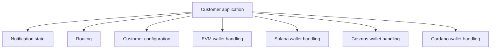
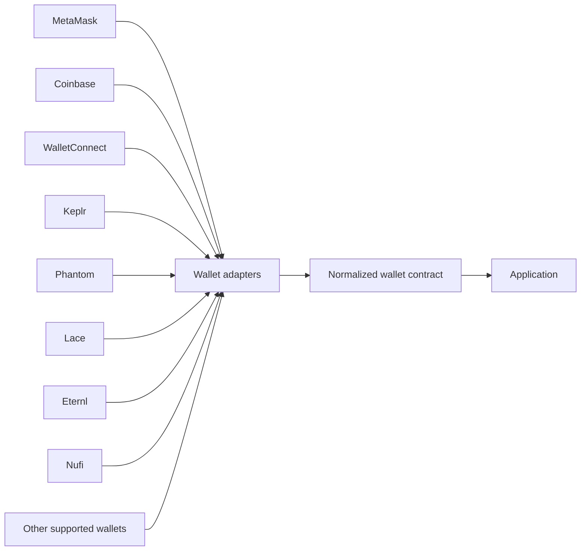
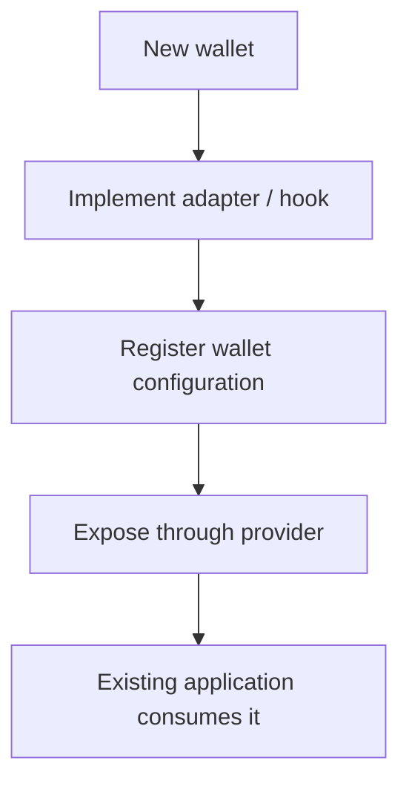
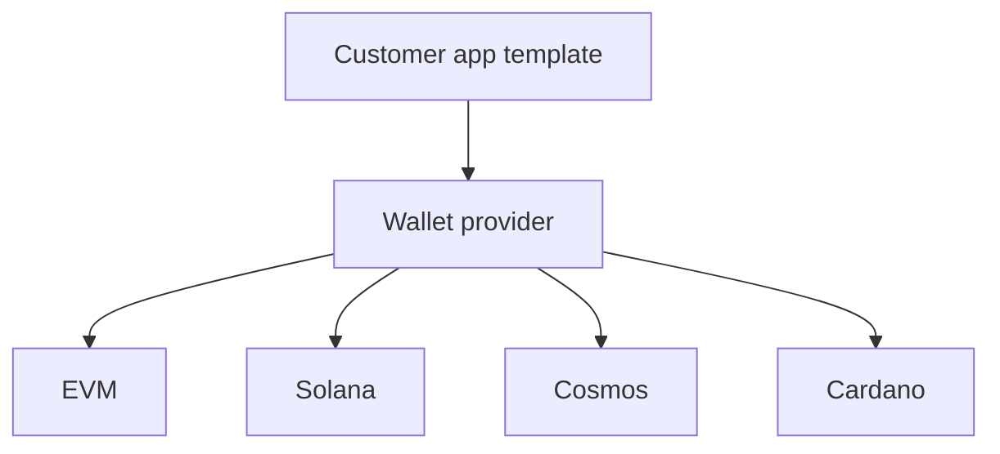

"Support another wallet" sounds like a small frontend task until the application supports more than one blockchain ecosystem.

The UI may only need another option in a selector, but underneath that button are different discovery mechanisms, address encodings, connection lifecycles and signing APIs. If those differences leak into application code, every new wallet makes the integration surface harder to reason about.

I ran into this while building reusable customer-facing applications around the Notifi SDK. The application needed wallet-based authentication, but different customers could require different chains and wallet ecosystems. The application itself was supposed to stay reusable.

That forced a boundary: wallet variation could not live in the page.

## The application needed a stable contract

From the application's point of view, wallet authentication is conceptually simple:

```text
is the wallet available?
connect
get the user's key or address
sign a message
disconnect
```

The implementation is not simple.

An EVM wallet may expose an EIP-1193 provider and use a hex address. A Cosmos wallet may expose a bech32 address and return a different signature structure. Solana uses another key representation and transaction model. Cardano wallets introduce their own APIs and encoded address formats.

If the host application owns those details, authentication quickly becomes a tree of chain-specific branches.

The reusable application would then need to know both product behavior and wallet protocol behavior:



That is the wrong dependency direction.

## Move ecosystem knowledge behind a provider boundary

The answer became a dedicated package: [`@notifi-network/notifi-wallet-provider`](https://github.com/notifi-network/notifi-sdk-ts/tree/main/packages/notifi-wallet-provider).

The package owns the chain- and wallet-specific integrations and exposes a shared React-facing surface to the rest of the application.

The important part is not the React context itself. The important part is what the context prevents the application from needing to know.

At a high level, the boundary looks like this:



The public package now supports wallets across EVM, Cosmos, Solana and Cardano families. The application consumes one provider instead of importing each wallet implementation directly.

## Normalize capabilities, not implementations

A useful abstraction does not pretend all wallets are internally identical.

Instead, it defines the capabilities the application actually needs.

The public wallet types converge on concepts such as:

```text
isInstalled
walletKeys
connect
disconnect
signArbitrary
sendTransaction   // where supported
websiteURL
```

Behind that contract, wallet-specific implementations are still free to differ.

For example, key material is normalized into a structure that can represent several encodings:

```text
hex
bech32
base58
base64
cbor
```

The application does not have to collapse those formats into one fictional universal address. It asks the selected wallet for the representation needed by the authentication path.

That is an important distinction. Good abstraction removes irrelevant variation; it does not erase meaningful protocol differences.

## Signing is where the differences become real

Message signing is a good example of why a shared interface helps.

An EVM wallet can sign a UTF-8 message and return a hex signature. A Cosmos wallet may accept bytes and return a structured signature. Solana and Cardano expose different APIs again.

The integration layer still needs to turn those outputs into the shape expected by the SDK authentication flow, but it can do so through one selected-wallet path instead of embedding each wallet library throughout the application.

The application becomes responsible for adapting **one normalized wallet object to the SDK auth contract**.

The wallet provider becomes responsible for adapting **many external wallet protocols to the normalized wallet object**.

Those are much cleaner responsibilities.

## A factory boundary makes new wallets cheaper

Once wallet behavior is behind one interface, adding support becomes a local change instead of an application-wide one.

Conceptually:



That does not mean every wallet is zero-cost. Detection can be inconsistent. Some providers initialize late. Standards evolve. Hardware wallets and chain-specific signing flows create special cases.

But the cost is contained.

The customer application does not need a new routing model, a new auth context or a second copy of the subscription UI because another wallet was added.

## The abstraction also improved product delivery

This wallet layer was not created in isolation. It supported a broader delivery model built around the public [`notifi-dapp-example`](https://github.com/notifi-network/notifi-sdk-ts/tree/main/packages/notifi-dapp-example).

That application is intended to be reused across integrations. A customer's branding and configuration may change, and so may the required chain or wallet. If those dimensions were coupled, each combination would become another bespoke application:

```text
Customer A + EVM + MetaMask
Customer B + Solana + Phantom
Customer C + Cosmos + Keplr
Customer D + Cardano + Lace
```

With a wallet boundary, the shape is different:



The customer-specific choice moves into configuration and supported-provider selection rather than application architecture.

## Standards still matter inside an abstraction

A provider layer should not become an excuse to permanently hide outdated integrations.

Wallet ecosystems change. Browser wallet discovery standards improve, packages get replaced and providers change how they inject themselves into the page. The abstraction gives us one place to respond to those changes, but the adapter itself still needs to follow the ecosystem.

That was useful when wallet discovery moved toward standards such as EIP-6963. The host application did not need to learn a new discovery strategy; the wallet layer could evolve behind the same product-facing contract.

This is one of the biggest benefits of an adapter boundary around third-party ecosystems: change remains inevitable, but its blast radius becomes deliberate.

## Where I would draw the boundary again

If I were designing the same system from scratch, I would keep the same basic rule:

> The application should understand authentication requirements, but it should not understand wallet implementation details.

I would also make three things explicit early:

**Capability contracts.** Define the smallest set of operations the product needs instead of exposing raw provider objects everywhere.

**Key formats.** Treat address and public-key representation as part of the chain contract. Do not normalize away information the backend actually needs.

**Registration.** Make wallet support declarative enough that adding a provider mostly means implementing an adapter and registering its capabilities.

Those constraints make the package easier to extend without turning the abstraction into another monolith.

## The broader lesson

The wallet provider solved a wallet problem, but the architectural lesson is more general.

Reusable customer software works best when unstable external ecosystems sit behind narrow boundaries. The stable product should depend on the capability it needs, not on every vendor-specific way that capability can be delivered.

For this system, the stable requirement was simple: connect an identity and produce the signing behavior needed for authentication.

Everything below that line could change — wallet vendor, chain, discovery mechanism, address encoding, signing API — without forcing the customer application to become a different product.
