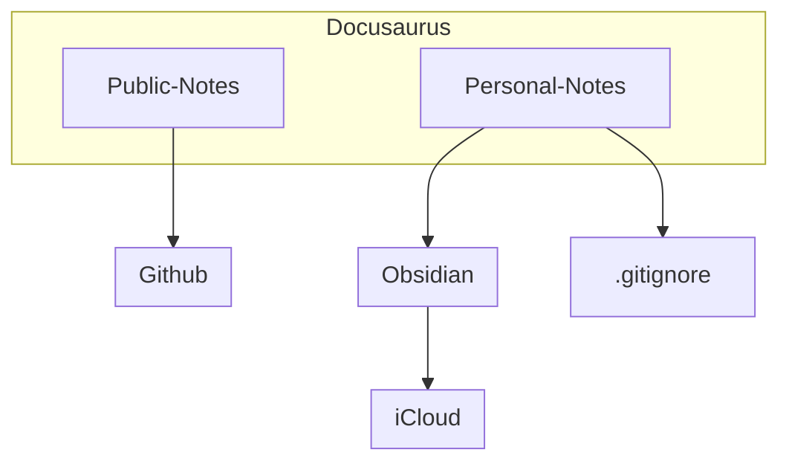

Taking note is always a topic that I want to improve. Docusaurus is the best tool for me for now. I can use markdown to take my note and publish it to my host server so that I can access anytime, anywhere.

But it comes with some limitations. Some of my personal notes are not suitable to be published to the public. So I need to find another way to take my personal notes.

I realized a best way is integrating my docusaurus with obsidian which can be sync with my iCould. At the same time, I can also use Obsidian as a sub-folder in my docusaurus project without publishing it.



As you can see, I can use the same markdown file in my docusaurus and obsidian. And I can also use the same git repo to manage my notes.

The way to link the obsidian note inside the docusaurus is

1. Download the obsidian App and select the iCloud sync. Then it will create a new folder (Obsidian) in your iCloud.

2. Create a symbolic link in your docusaurus project to the note folder in the Obsidian folder.


```bash
ln -s ~/path/to/your/iCloud/Obsidian/Demo ~/path/to/your/docusaurus-project/docs/notes/personal-obsidian
```

Then we can edit the obsidian note in the docusaurus project. And we can also use the same git repo to manage the notes. 🚀
