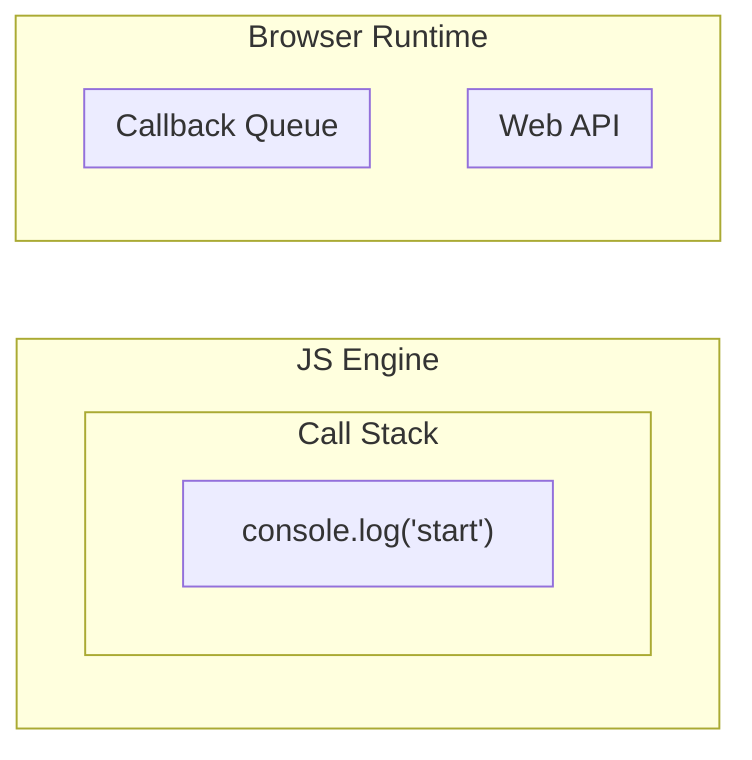
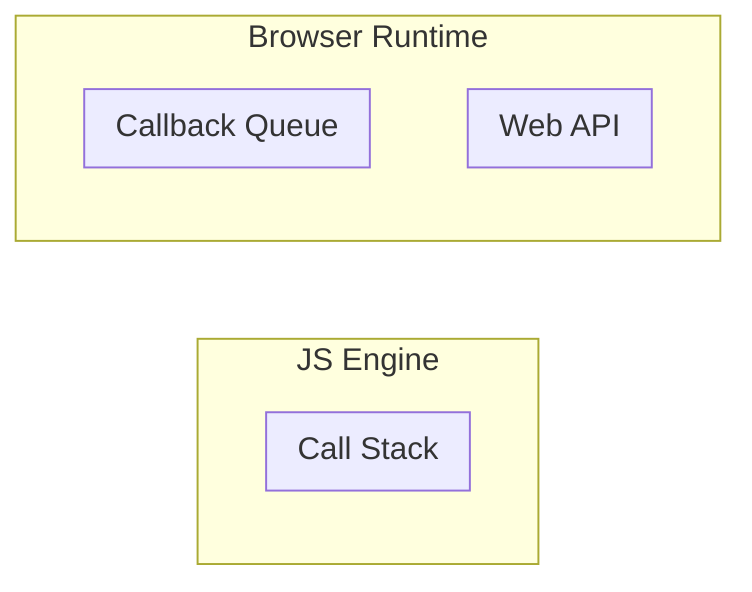
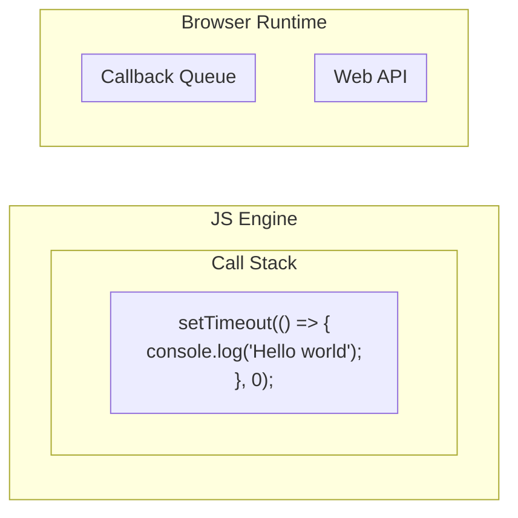
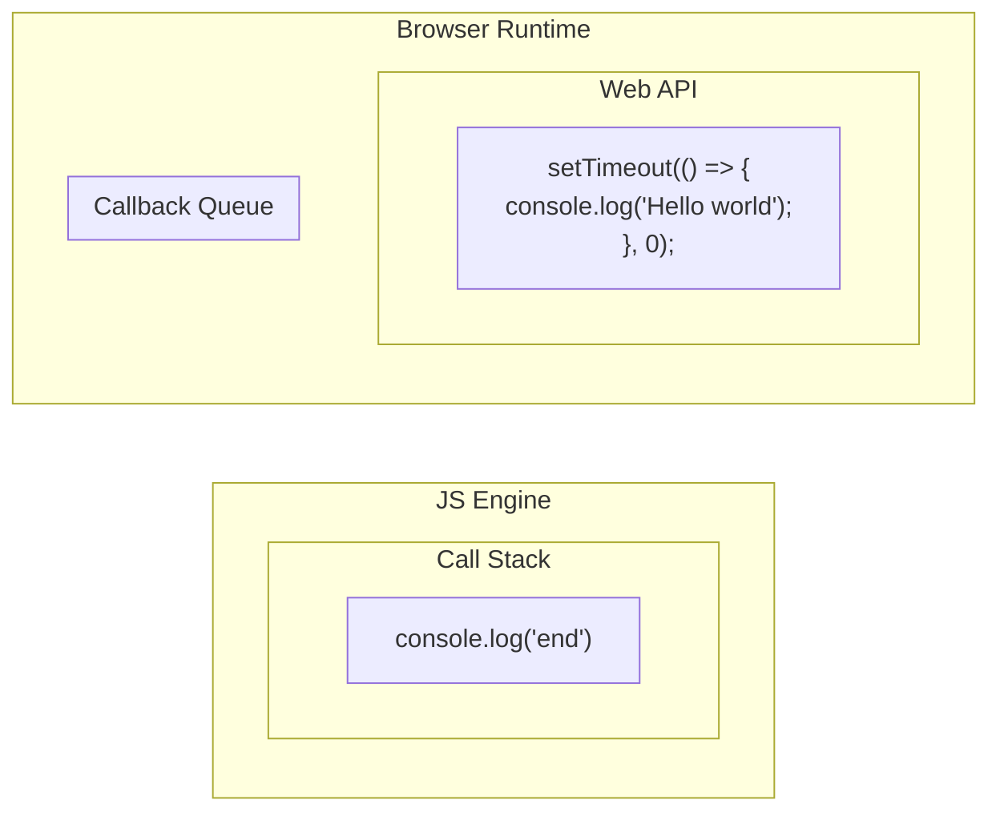
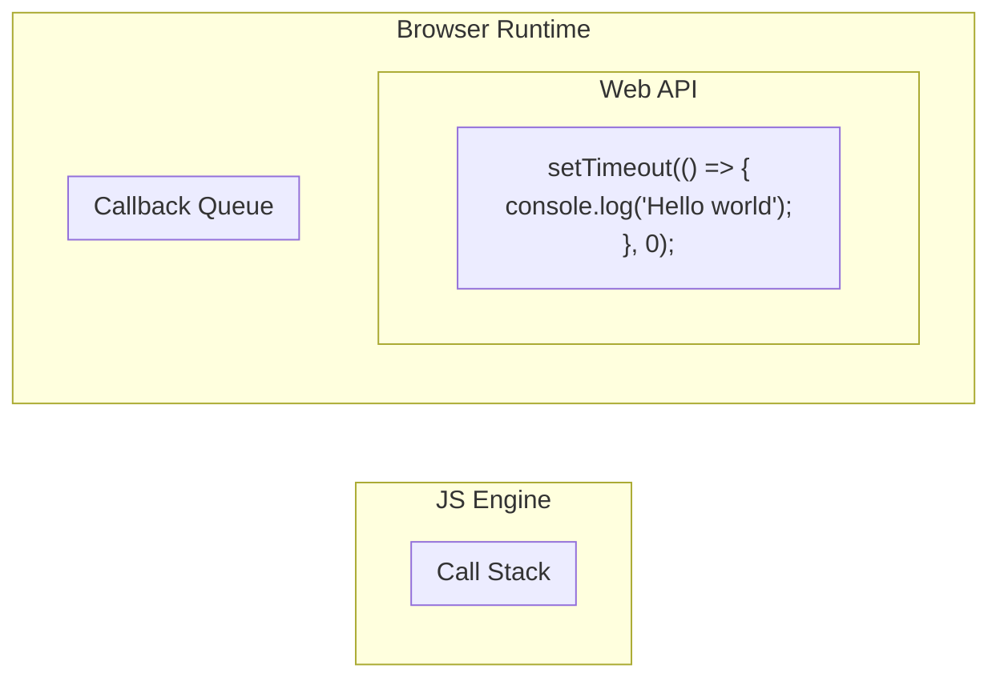
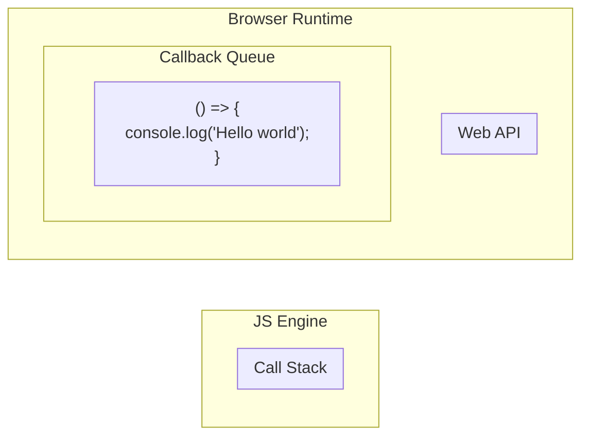
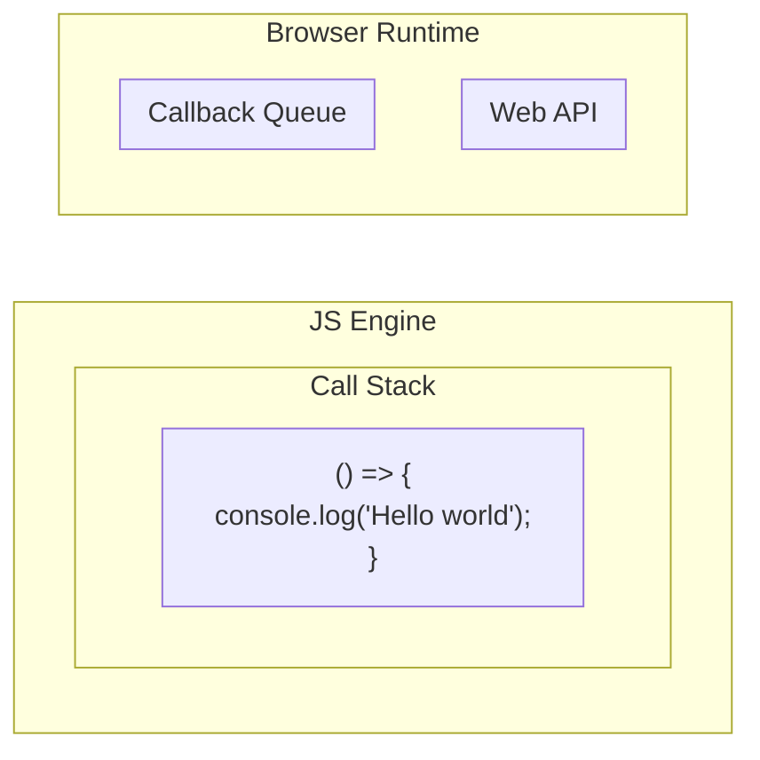
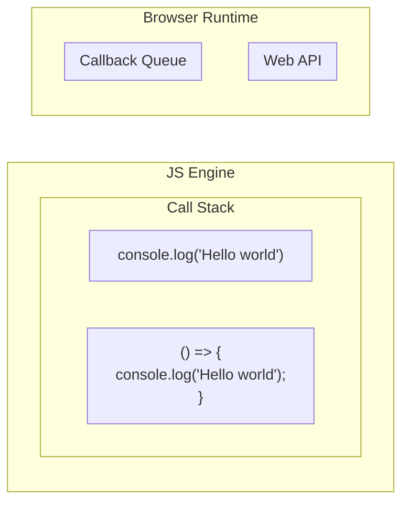

import Drawio from "@theme/Drawio";
import drawIo from "!!raw-loader!@site/static/drawio/js-runtime-env.drawio";

## Jvascript Engine (V8)

<Drawio content={drawIo} page={1} zoom={0.5} editable={true} maxHeight={300} />

Javascript engine is composed of two parts:

1. Heap

Just a memory space to store all the variables that are declared in the program.

```js
const a = "Hello world";
const b = "I am Eric";
```

2. Call stack

Simply speaking, it is a stack to store all the function calls.

If we execute the following code:

```js
const sayHello = () => {
  const sayHiToEric = () => {
    console.log(b);
  };
  console.log(a);
  sayHiToEric();
};
```

<details>
<summary>The flow of above call stack</summary>

```js title="Step 1"
sayHello(); // push sayHello() to the call stack
```

Then js enjine will process the code inside the function `sayHello()`

```js title="Step 2"
console.log(a); // push console.log(a)
sayHello();
```

Then JS will pop the console.log(a) from the call stack right after executing it.

```js title="Step 3"
// console.log(a) // pop out console.log(a)
sayHello();
```

```js title="Step 4"
sayHiToEric(); // push sayHiToEric() to the call stack
sayHello();
```

Then JS enjine will process the code inside the function `sayHiToEric()`

```js title="Step 5"
console.log(b); // push console.log(b) to the call stack
sayHiToEric();
sayHello();
```

Then JS will pop the console.log(b) from the call stack right after executing it.

```js title="Step 6"
// console.log(b) // pop out console.log(b) from the call stack
sayHiToEric();
sayHello();
```

```js title="Step 7"
// sayHiToEric() // pop out sayHiToEric() from the call stack
sayHello();
```

```js title="Step 8"
// sayHello() // pop out sayHello() from the call stack
```

```js title="Step 9"
// call stack is empty
```

</details>

This is a so-called single-threaded language. It means that it can only execute one thing at a time.

However, why we are taught that JS is a non-blocking language? Even its runtime is single-threaded.

## What makes Javascript as None-blocking single-threaded language

`Asynchronous programming` and `Javascript runtime env` are the key to make JS non-blocking.

### Asynchronous programming

Here it is a simple example of asynchronous programming:

```js
console.log("start");

setTimeout(() => {
  console.log("Hello world");
}, 1000);

console.log("end");

// Output:
// start
// end
// Hello world
```

Why the end is printed before the Hello world? we just said that JS is single-threaded??

The reason is that the `setTimeout()` is not executed by the JS engine. It is executed by the `Web API` which is provided by the browser runtime.

So, now we know, in order to let JS code to run asynchronously, we need not only the JS engine.

We also need so-call `Javascript runtime environment`.

### Browser runtime environment

Javascript runtime environment is part of the browser. It is composed of:

1. Web API

   - DOM (Document)
   - AJAX
   - setTimeout
   - setInterval
   - ...

as can be seen, the `setTimeout()` is not part of the JS engine. It is part of the Web API. It is provided by the browser so we can do asynchronous programming.

2. Callback queue

The callback stack is a queue to store all the callback functions. It is also called `task queue`.

:::info
browser also provides another queue stack called `microtask queue`. It is used to store the callback functions of `Promise` and `async/await`.

The `microtask queue` has a higher priority than the `callback queue`. It means that the callback functions in the `microtask queue` will be executed before the callback functions in the `callback queue`.
:::

3. Event loop

The event loop is a loop to check if the `callback queue` is empty. If it is not empty, it will pop the callback function from the `callback queue` and push it to the `call stack` to execute it.

I know it is supper confusing. Let's see the following example:

```js
console.log("start");

setTimeout(() => {
  console.log("Hello world");
}, 0);

console.log("end");
```

## How does it work (Example)

### Step#1

First, the JS engine will push the `console.log("start")` to the `call stack` and execute it right away.



```bash
# Output:
# start
```

### Step#2

After executing the `console.log("start")`, the JS engine will pop it out from the `call stack`.



### Step#3

Then, the JS engine will push the `setTimeout()` to the `call stack` and execute it right away.



### Step#4

And browser runtime realizes that it is a Web API. So it will be pushed to the `Web API` to execute it.

At the same time, the JS engine executes the `console.log("end")` .



### Step#5

After executing the `console.log("end")`, the JS engine will pop it out from the `call stack`.



### Step#6

After Web Api finishes counting the timeOut, it will push the callback function to the `callback queue`.



### Step#7

The event loop will check if the `callback queue` is empty. If it is not empty, it will pop the callback function from the `callback queue` and push it to the `call stack` to execute it.



### Step#8

Then the JS engine will execute the callback function and follows the call stack rule. (Step#9 & Step#10)



### Step#9


### Step#10


