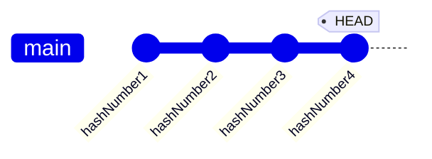
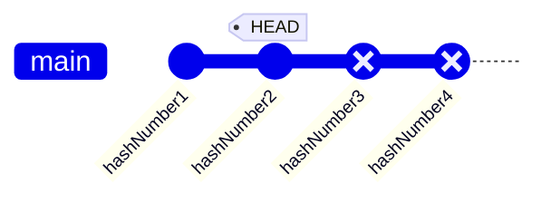
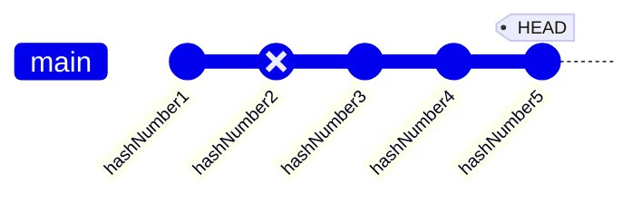

# git revert vs git reset

Basically, there are three ways to undo a commit:

1. `git reset --hard <commit_hash>`
2. `git rebase -i` --> then use `delete` command in interactive mode
3. `git revert <commit_hash>`

## `git reset --hard <commit_hash>`

`git reset --hard <commit_hash>` is a command that allows you to reset the current branch to a specific commit. Or using `git reset --hard HEAD~3` to reset the current branch to the 3rd commit before the current commit. See the following example:

```bash
git reset --hard HEAD~2 # or
git reset --hard hashNumber2
```

<details>
<summary>Before reset</summary>



</details>

<details>
<summary>After reset</summary>



</details>

We are not able to only delete particular commit using "reset" command. We can only delete all commits after the specified commit.

## `git rebase -i`

`git rebase -i` is a command that allows you to interactively rebase the current branch. It is often used when you want to delete a commit from the commit history.

We will be brought to an iteractive mode when we use `git rebase -i HEAD~3` command. We can then use `delete` command to delete the commit from the commit history.

<details>
<summary>Example</summary>

```bash
pick 1cf1da5 #2
pick e4af9d6 #3
pick 352c1ac Revert "#2"

# Rebase 44dd3fa..352c1ac onto 44dd3fa (3 commands)
#
# Commands:
# p, pick <commit> = use commit
# r, reword <commit> = use commit, but edit the commit message
# e, edit <commit> = use commit, but stop for amending
# s, squash <commit> = use commit, but meld into previous commit
# f, fixup [-C | -c] <commit> = like "squash" but keep only the previous
#                    commit's log message, unless -C is used, in which case
#                    keep only this commit's message; -c is same as -C but
#                    opens the editor
# x, exec <command> = run command (the rest of the line) using shell
# b, break = stop here (continue rebase later with 'git rebase --continue')
# d, drop <commit> = remove commit
# l, label <label> = label current HEAD with a name
# t, reset <label> = reset HEAD to a label
# m, merge [-C <commit> | -c <commit>] <label> [# <oneline>]
# .       create a merge commit using the original merge commit's
# .       message (or the oneline, if no original merge commit was
# .       specified); use -c <commit> to reword the commit message
#
# These lines can be re-ordered; they are executed from top to bottom.
#
# If you remove a line here THAT COMMIT WILL BE LOST.
#
# However, if you remove everything, the rebase will be aborted.
```

</details>

If we are working on a shared branch, we should not use `git rebase -i` command to delete a commit from the commit history. It is because `git rebase -i` rewrites the commit history. It will cause conflicts when other developers try to push their commits to the remote repository. Instead, we should use `git revert` command.

## `git revert`

`git revert` is a command that allows you to revert a commit without rewriting the commit history. It is often used when you want to undo a commit that has been pushed to the remote repository. It creates a new commit that undoes the changes from the specified commit. See the following example:

```bash
git revert hashNumber2
```

<details>
<summary>Before reset</summary>


</details>

<details>
<summary>After reset</summary>



</details>
