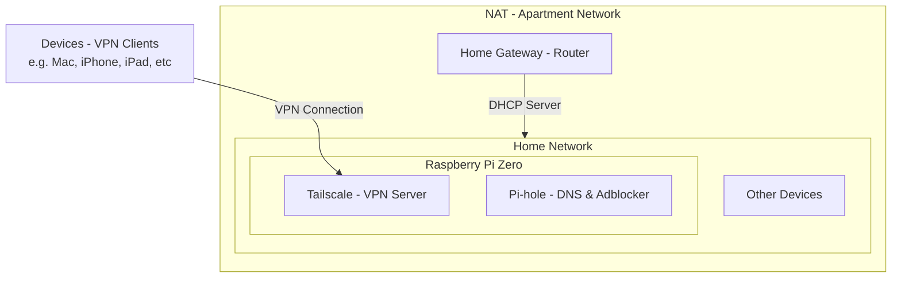

## 🎯 Goal

Configure Pi-hole to function as:

1. The primary **DNS server** for your home network.
2. The **DNS resolver** for VPN clients connected via **Tailscale**.

This ensures ad-blocking and domain filtering both at home and over remote VPN connections.



Before starting, make sure Tailscale VPN is correctly set up.

---

## 🏠 Setting Pi-hole as DNS for Local Network

1. Set your **router's DHCP DNS server** to point to the Pi-hole IP (e.g., `192.168.68.52`).

⚠️ **Issue: macOS DNS fallback behavior**

Running `scutil --dns` on macOS may show:

```text
resolver #1
nameserver[0] : 192.168.68.52
nameserver[1] : 1.1.1.1
```

- If Pi-hole blocks a domain and returns an empty response, macOS may fallback to the secondary DNS (`1.1.1.1`), bypassing Pi-hole.
- This undermines ad-blocking and parental control, due to OS-level DNS redundancy behavior.

### ✅ Recommended Solutions

- **Solution 1**: Remove all fallback DNS entries in device or router settings.
- **Solution 2**: Use your router’s DNS forwarding or NAT rules to **force all DNS traffic to Pi-hole**.

  - ⚠️ Many consumer routers don't support this feature.

- **Solution 3** (Best): Implement **DNS hijacking** via `iptables` on the Pi Zero to intercept all port 53 traffic and redirect to Pi-hole.

---

### 🛠 DNS Hijacking via Pi Zero

1. Enable IP forwarding:

   - Edit `/etc/sysctl.conf`:

     ```bash
     net.ipv4.ip_forward=1
     ```

   - Apply changes:

     ```bash
     sudo sysctl -p
     ```

2. Add `iptables` rules to redirect DNS traffic:

   ```bash
   sudo iptables -t nat -A PREROUTING -p udp --dport 53 -j DNAT --to-destination 192.168.68.52:53
   sudo iptables -t nat -A PREROUTING -p tcp --dport 53 -j DNAT --to-destination 192.168.68.52:53
   ```

This ensures that **all devices**, even those using external DNS like `8.8.8.8`, will be transparently redirected to Pi-hole.

---

## 🏕️ Setting Pi-hole as DNS for VPN Clients (via Tailscale)

### 1️⃣ Enable Tailscale Subnet Routing

Run Tailscale with the `--advertise-routes` flag:

```bash
sudo tailscale up --advertise-routes=192.168.68.0/24
```

If you see this message in the Tailscale admin console:

> _This machine has IP forwarding disabled..._

Make sure IP forwarding is enabled (same as in the DNS hijacking section above).

You can also re-authenticate:

```bash
sudo tailscale down && sudo tailscale up --advertise-routes=192.168.68.0/24
```

### 2️⃣ Enable Subnet Routing in Tailscale Admin Panel

Log in to the Tailscale admin console and enable routing for the subnet `192.168.68.0/24`.

### 3️⃣ Configure Tailscale DNS Settings

- Go to **DNS settings** in Tailscale admin.
- Add your Pi-hole IP (e.g., `192.168.68.52`) as a nameserver.
- Enable:

  - **Override local DNS**
  - Or enable **MagicDNS**

- Save your settings.

---

### ✅ Verify DNS Resolution on Pi-hole

Check incoming DNS queries on Pi-hole using `tcpdump`:

```bash
# For local (Wi-Fi) traffic
sudo tcpdump -i wlan0 -n port 53

# For VPN (Tailscale) traffic
sudo tcpdump -i tailscale0 -n port 53
```

---

### 4️⃣ Allow DNS Requests from VPN Clients

By default, Pi-hole listens only to local interfaces. To allow VPN clients (100.x.x.x), you must adjust its listening mode.

Edit `/etc/pihole/pihole.toml`:

```toml
interface = "wlan0"
listeningMode = "ALL"  # Default is "LOCAL"
```

#### 🔍 Explanation of `listeningMode` Options

| Configuration                                             | Safe?        | Notes                                                                                     |
| --------------------------------------------------------- | ------------ | ----------------------------------------------------------------------------------------- |
| `interface = "wlan0"`<br/>`listeningMode = "LOCAL"`       | ✅ Safe      | Default setting. Only accepts local traffic.                                              |
| `interface = "wlan0"`<br/>`listeningMode = "ALL"`         | ⚠️ Low Risk  | Accepts traffic from all interfaces. Make sure port 53 is not exposed to public internet. |
| `interface = "tailscale0"`<br/>`listeningMode = "SINGLE"` | ✅ Very Safe | Accepts DNS only from Tailscale clients.                                                  |
| `interface = ""`<br/>`listeningMode = "BIND"`             | ✅ Safe      | Allows multi-interface binding safely.                                                    |

---

### 5️⃣ Restart Pi-hole DNS Daemon

```bash
sudo systemctl restart pihole-FTL
```
