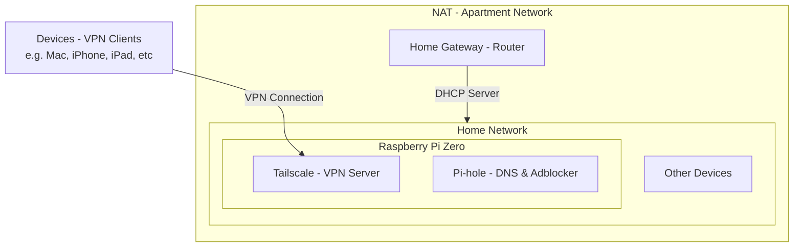

## 🎯 Goal

Securely access your entire home network (NAS, Pi-hole, Home Assistant, etc.) from anywhere.



---

## 🛠️ Solution Overview

We install **Tailscale** on a **Raspberry Pi Zero W** inside the home network.
The goal is to make this Pi act as a **VPN gateway (Subnet Router)** so that remote clients connected through Tailscale can access other LAN devices (e.g., `192.168.x.x` devices).

### Step 1: Install Tailscale on the Pi

```bash
curl -fsSL https://tailscale.com/install.sh | sh
```

### Step 2: Advertise the Home Network Subnet

Enable subnet routing on the Pi:

```bash
sudo tailscale up --advertise-routes=192.168.68.0/24
```

> `--advertise-routes` tells Tailscale to route traffic destined for this subnet through this device.

### Step 3: Approve the Route via Tailscale Admin Panel

Go to [Tailscale Admin Console](https://login.tailscale.com/admin/machines):

1. Find your Raspberry Pi in the machine list.
2. Enable the subnet route (e.g., `192.168.68.0/24`) via the toggle.

After this, all your connected devices can access your home network through the Pi.

---

## 📚 Appendix

### Understanding `--advertise-routes` and `--accept-routes`

| Concept              | Meaning                                                                                     |
| -------------------- | ------------------------------------------------------------------------------------------- |
| `--advertise-routes` | "I'm offering a route to this subnet." Used by the **Subnet Router** (e.g., your Pi)        |
| `--accept-routes`    | "I'm willing to use routes advertised by others." Used by **clients** (e.g., phone, laptop) |

---

### 🧠 How Tailscale Routing Works

#### Example:

- `Laptop` joins Tailscale: gets IP `100.64.1.1`
- `Phone` joins Tailscale: gets IP `100.64.1.2`
- They can communicate over Tailscale normally.

But if you want to reach a **local-only device** (e.g., NAS `192.168.68.100`), you'll need:

1. A Pi on your LAN to **advertise** the route.
2. Clients (laptop, phone) to **accept** that route.

```bash
# On your Pi:
sudo tailscale up --advertise-routes=192.168.68.0/24
```

Tells Tailscale: “I can forward traffic for this subnet.”

But clients **won’t automatically use that route** unless:

- `--accept-routes` is enabled on them (usually automatic via GUI apps).
- You approved the route in the Tailscale Admin Console.

---

### 🧩 Who Should Use What?

| Role               | Action                             | Tailscale Flag                                           |
| ------------------ | ---------------------------------- | -------------------------------------------------------- |
| Pi (Subnet Router) | "I can route to 192.168.68.0/24"   | `--advertise-routes`                                     |
| Phone / Laptop     | "I’ll use that route if available" | `--accept-routes` (automatically handled in GUI clients) |
| Admin Console      | "Approve the advertised route"     | ✅ Manually approve Subnet Route                         |

---

### 🔍 Do You Need `--accept-routes` on the Pi?

No.
As the **Subnet Router**, the Pi does **not** need to accept other people's routes. It only needs to advertise its own.

`--accept-routes` is only relevant for client devices like laptops or phones that want to reach other subnets **through** another device.

---

### ✅ Usage Guidelines

| Use Case                               | Should You Use `--accept-routes`?      |
| -------------------------------------- | -------------------------------------- |
| Pi as Subnet Router                    | ❌ Not needed                          |
| Phone / Laptop connecting from outside | ✅ Yes (usually handled automatically) |

---

## ✅ Summary Table

| Flag                                | Meaning                                      | Who Uses It           |
| ----------------------------------- | -------------------------------------------- | --------------------- |
| `--advertise-routes=192.168.x.0/24` | "I'm the gateway to this subnet"             | 🧱 Pi (Subnet Router) |
| `--accept-routes`                   | "I'm willing to follow others' subnet paths" | 📱 Phones, 💻 Laptops |
