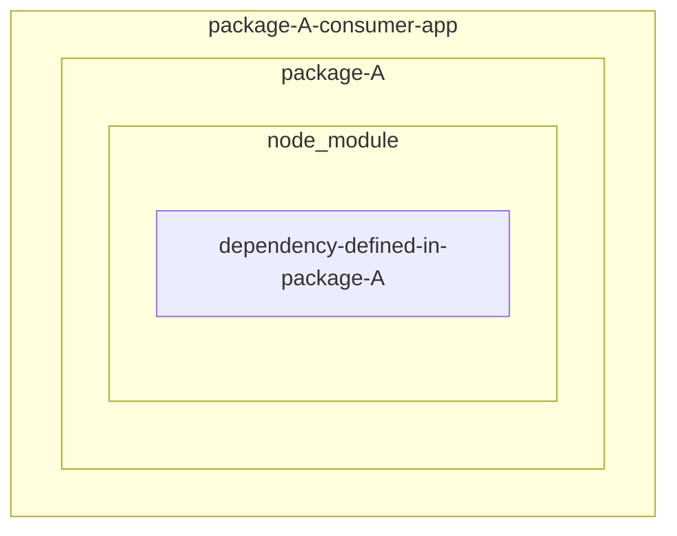
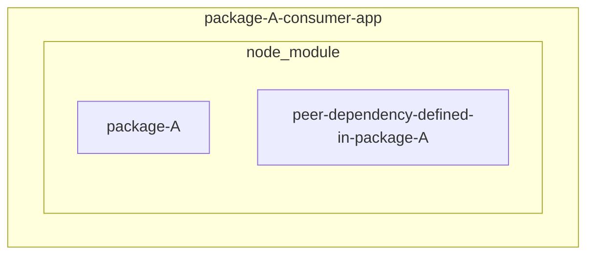

The article, we are taking a quick look at the different types of dependencies in npm: normal, dev and peer.

Firstly, the use case of each type of dependencies

1. normal dependencies: straightforward, the packages will be imported in root project during "RUNTIME".



2. dev dependencies: the packages will be imported in root project, but will be used under development phase only, for example, testing, linting, bundling and building ... etc.

3. peer dependencies: the section is only used when the package is a library. There are some packages that are required to run the library, but should not be included in the library's `node_modules` folder. Instead, the consumer of the library should install them by themselves. The most common example is `react` and `react-dom`.



## More details on peer dependencies

`react` and `react-dom` are always the dependencies of all the react component libraries, but they should not be included in the library's `node_modules` folder.
The consumer of the library will need (or want) to install them by themselves at the root project level, because the root project highly likely to use their own version of `react` and `react-dom`.
Accordingly, the peer dependencies are meant to inform developers that certain other library versions are required and let them know that they should install them in their own project.
The benefit of using peer dependencies is that it can help to avoid the duplication of the same library in the `node_modules` folder. Ex. imagine if the library has 1000 dependencies, and all of them have their own full set of `react` and `react-dom` if they are not normal dependencies instead of peer dependencies.

Accordingly, it is important to think about the dependencies carefully when developing a library.

:::tip
The most common pattern is to think about the fact that

1.  whether the dependency will be highly likely to be used by the customer's project. If yes, then it should be a peer dependency.
2.  whether the library want to have the control of the dependency version. If the library wants to always use that certain version of the dependency no matter what version the customer's project is using, then it should not be a peer dependency.

:::

## The possible issue with peer dependencies

After `npm install` then the following error thrown

```bash
"XXX" has unmet peer dependency "XXX"
```

Resolving the peer dependencies issue could be complicated. Let's take a look at the real example. We will make sure of the following three packages to demonstrate:

In a example project named `example-app`, we have the two dependencies: `@notifi-network/notifi-axios-utils@0.76.0` and `axios-jwt@3.0.2`.

1. `@notifi-network/notifi-axios-utils@0.76.0` has a peer dependency `axios@^0.26.1` defined in the `peerDependencies` section.

2. `axios-jwt@3.0.2` has the peer dependency `axios@^1.4.0` defined in the `peerDependencies` section.

Obviously, the `@notifi-network/notifi-axios-utils@0.76.0` and `axios-jwt@3.0.2` are not compatible with each other because their peer dependencies are not compatible with each other.

So the above error message mentioned in the beginning will be thrown when the `example-app` has `axios@1.4.0` installed with `@notifi-network/notifi-axios-utils@0.76.0` and `axios-jwt@3.0.2`.

```bash
npm ERR! code ERESOLVE
npm ERR! ERESOLVE unable to resolve dependency tree
npm ERR!
npm ERR! While resolving: peer-dep-test@1.0.0
npm ERR! Found: axios@1.4.0
npm ERR! node_modules/axios
npm ERR!   axios@"^1.4.0" from the root project
npm ERR!
npm ERR! Could not resolve dependency:
npm ERR! peer axios@"^0.26.1" from @notifi-network/notifi-axios-utils@0.76.0
npm ERR! node_modules/@notifi-network/notifi-axios-utils
npm ERR!   @notifi-network/notifi-axios-utils@"0.76.0" from the root project
npm ERR!
npm ERR! Fix the upstream dependency conflict, or retry
npm ERR! this command with --force, or --legacy-peer-deps
npm ERR! to accept an incorrect (and potentially broken) dependency resolution.
npm ERR!
npm ERR! See /Users/macbookpro4eric/.npm/eresolve-report.txt for a full report.

npm ERR! A complete log of this run can be found in:
npm ERR!     /Users/macbookpro4eric/.npm/_logs/2023-07-22T11_08_00_465Z-debug-0.log
```

As can be seen in the above error message, the `@notifi-network/notifi-axios-utils@0.76.0` package cannot be installed because the `axios@^0.26.1` is required by the `@notifi-network/notifi-axios-utils@0.76.0`'s peer dependency.

However, if we install the `axios@0.26.1` package, then the following error will be thrown because the `axios@"^0.26.1"` is required by the `axios-jwt@3.0.2`'s peer dependency.

```bash
npm ERR! code ERESOLVE
npm ERR! ERESOLVE could not resolve
npm ERR!
npm ERR! While resolving: peer-dep-test@1.0.0
npm ERR! Found: axios@0.26.1
npm ERR! node_modules/axios
npm ERR!   peer axios@"^0.26.1" from @notifi-network/notifi-axios-utils@0.76.0
npm ERR!   node_modules/@notifi-network/notifi-axios-utils
npm ERR!     @notifi-network/notifi-axios-utils@"^0.76.0" from the root project
npm ERR!   axios@"0.26." from the root project
npm ERR!
npm ERR! Could not resolve dependency:
npm ERR! axios-jwt@"3.0.2" from the root project
npm ERR!
npm ERR! Conflicting peer dependency: axios@1.4.0
npm ERR! node_modules/axios
npm ERR!   peer axios@"^1.4.0" from axios-jwt@3.0.2
npm ERR!   node_modules/axios-jwt
npm ERR!     axios-jwt@"3.0.2" from the root project
npm ERR!
npm ERR! Fix the upstream dependency conflict, or retry
npm ERR! this command with --force, or --legacy-peer-deps
npm ERR! to accept an incorrect (and potentially broken) dependency resolution.
npm ERR!
npm ERR! See /Users/macbookpro4eric/.npm/eresolve-report.txt for a full report.

npm ERR! A complete log of this run can be found in:
npm ERR!     /Users/macbookpro4eric/.npm/_logs/2023-07-22T11_16_14_146Z-debug-0.log
```

## References

- [Peer Dependencies - Explained](https://www.youtube.com/watch?v=h1z2qGV4KPI)
