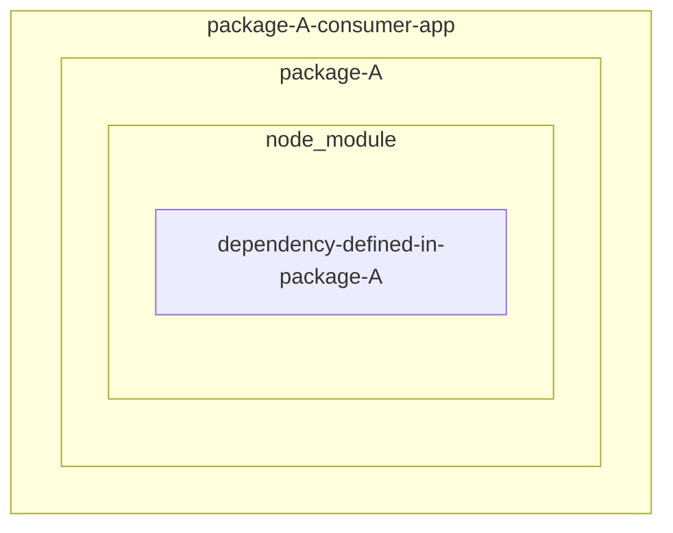
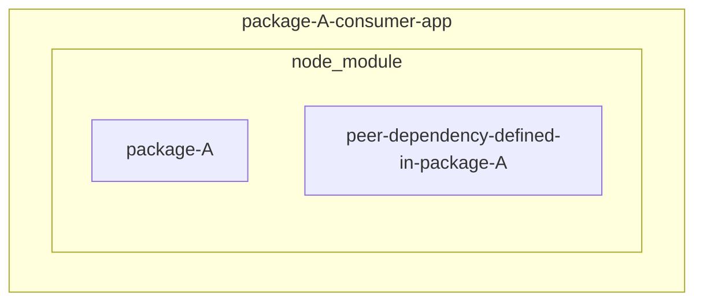

## Background

Recently, I have run into a warning issue about dependencies when `npm install` .

```bash
"XXX" has unmet peer dependency "XXX"
```

So I decided to have a deeper look at the dependencies in npm especially the `peerDependencies`.

## Types of dependencies

There are 3 types of dependencies in npm:

- normal dependencies
- dev dependencies
- peer dependencies

### Normal dependencies

Normal dependencies are the dependencies that are required to run the package.

```json
{
  "dependencies": {
    "react": "^17.0.2",
    "react-dom": "^17.0.2",
    "react-scripts": "~4.0.3",
    "web-vitals": "^1.1.2"
  }
}
```

If a npm package defines a dependency in the `dependencies` section, it means that the package will be included in the `node_modules` folder of that particular package when you run `npm install`.



### Dev dependencies

Dev dependencies are the dependencies that are only required to develop the package.

```json
{
  "devDependencies": {
    "@types/jest": "^26.0.24",
    "@types/node": "^12.0.0",
    "@types/react": "^17.0.0",
    "@types/react-dom": "^17.0.0",
    "jest": "^26.6.3",
    "ts-jest": "^26.5.4",
    "typescript": "^4.0.3"
  }
}
```

If a npm package defines a dependency in the `devDependencies` section, the package will not be included in the `node_modules` of the package when you run `npm install` because those packages are normally used for development only (ex. testing, linting, etc.).

### Peer dependencies

Peer dependencies are the dependencies that are required to run the package but not included in the `node_modules` of the package.

```json
{
  "peerDependencies": {
    "axios": "^0.26.1"
  }
}
```

If a npm package defines a dependency in the `peerDependencies` section, the consumer of the package will need to install the dependency by themselves and ensure the version is compatible with the one defined in the `peerDependencies` section.



As can be seen in the above diagram, the `package-A` does not necessarily include the `peer-dependency-defined-in-package-A` because it could work without the `peer-dependency-defined-in-package-A`.

However, there might be limitation that package A can only work with a specific version of `peer-dependency-defined-in-package-A` or the developers of package A only tested the package with a specific version of `peer-dependency-defined-in-package-A`. They cannot guarantee that the package will work with other versions of `peer-dependency-defined-in-package-A`.

## Peer dependencies real example

Resolving the peer dependencies issue could be complicated. Let's take a look at the real example. We will make sure of the following three packages to demonstrate:

1. `axios`

   This will be a required module in the exmaple app.

2. `@notifi-network/notifi-axios-utils@0.76.0`

   It has the peer dependency `axios@^0.26.1` defined in the `peerDependencies` section.

3. `axios-jwt@3.0.2`

   It has the peer dependency `axios@^1.4.0` defined in the `peerDependencies` section.

### Create consumer app

Firstly, we will create a consumer app to consume the `@notifi-network/notifi-axios-utils` package.

```bash
mkdir peer-dep-test && cd peer-dep-test && npm init -y
```

### Scenario 1

Because the `@notifi-network/notifi-axios-utils` package has the peer dependency `axios@^0.26.1` defined in the `peerDependencies` section, it means `@notifi-network/notifi-axios-utils` is not guaranteed to work with `axios` version greater than 1.0.0.

- Case#1: Axios@1.4.0 already installed in our package and then install `@notifi-network/notifi-axios-utils@0.76.0`

```bash
npm install axios@1.4.0
```

Then we see what happens when we install the `@notifi-network/notifi-axios-utils@0.76.0` package.

```bash
➜  npm install @notifi-network/notifi-axios-utils@0.76.0
npm ERR! code ERESOLVE
npm ERR! ERESOLVE unable to resolve dependency tree
npm ERR!
npm ERR! While resolving: peer-dep-test@1.0.0
npm ERR! Found: axios@1.4.0
npm ERR! node_modules/axios
npm ERR!   axios@"^1.4.0" from the root project
npm ERR!
npm ERR! Could not resolve dependency:
npm ERR! peer axios@"^0.26.1" from @notifi-network/notifi-axios-utils@0.76.0
npm ERR! node_modules/@notifi-network/notifi-axios-utils
npm ERR!   @notifi-network/notifi-axios-utils@"0.76.0" from the root project
npm ERR!
npm ERR! Fix the upstream dependency conflict, or retry
npm ERR! this command with --force, or --legacy-peer-deps
npm ERR! to accept an incorrect (and potentially broken) dependency resolution.
npm ERR!
npm ERR! See /Users/macbookpro4eric/.npm/eresolve-report.txt for a full report.

npm ERR! A complete log of this run can be found in:
npm ERR!     /Users/macbookpro4eric/.npm/_logs/2023-07-22T11_08_00_465Z-debug-0.log
```

As can be seen in the above error message, the `@notifi-network/notifi-axios-utils@0.76.0` package cannot be installed because the `axios@^0.26.1` might not be compatible with the `axios@1.4.0` installed in our package.

- Case#2: `@notifi-network/notifi-axios-utils@0.76.0` already installed in our package, then install `axios@1.4.0`

```bash
npm install @notifi-network/notifi-axios-utils@0.76.0
```

Then we see what happens when we install the `axios@1.4.0` package.

```bash
➜  npm install axios@1.4.0
npm WARN ERESOLVE overriding peer dependency
npm WARN While resolving: peer-dep-test@1.0.0
npm WARN Found: axios@0.26.1
npm WARN node_modules/axios
npm WARN   peer axios@"^0.26.1" from @notifi-network/notifi-axios-utils@0.76.0
npm WARN   node_modules/@notifi-network/notifi-axios-utils
npm WARN     @notifi-network/notifi-axios-utils@"^0.76.0" from the root project
npm WARN   1 more (the root project)
npm WARN
npm WARN Could not resolve dependency:
npm WARN peer axios@"^0.26.1" from @notifi-network/notifi-axios-utils@0.76.0
npm WARN node_modules/@notifi-network/notifi-axios-utils
npm WARN   @notifi-network/notifi-axios-utils@"^0.76.0" from the root project

added 7 packages, changed 1 package, and audited 11 packages in 538ms

1 package is looking for funding
  run `npm fund` for details

found 0 vulnerabilities
```

It only shows a warning message then the `axios@1.4.0` package is installed successfully.

:::caution

We need to be very careful in this case

:::

### Scenario 2

In this case, we have both `"axios": "0.26."` and `"@notifi-network/notifi-axios-utils": "^0.76.0"` installed.

Then we want to install the `axios-jwt@3.0.2` package which has the peer dependency `axios@^1.4.0` defined in the `peerDependencies` section.

```bash
npm install axios-jwt@3.0.2
```

Then we see what happens when we install the `axios-jwt@3.0.2` package.

```bash
npm ERR! code ERESOLVE
npm ERR! ERESOLVE could not resolve
npm ERR!
npm ERR! While resolving: peer-dep-test@1.0.0
npm ERR! Found: axios@0.26.1
npm ERR! node_modules/axios
npm ERR!   peer axios@"^0.26.1" from @notifi-network/notifi-axios-utils@0.76.0
npm ERR!   node_modules/@notifi-network/notifi-axios-utils
npm ERR!     @notifi-network/notifi-axios-utils@"^0.76.0" from the root project
npm ERR!   axios@"0.26." from the root project
npm ERR!
npm ERR! Could not resolve dependency:
npm ERR! axios-jwt@"3.0.2" from the root project
npm ERR!
npm ERR! Conflicting peer dependency: axios@1.4.0
npm ERR! node_modules/axios
npm ERR!   peer axios@"^1.4.0" from axios-jwt@3.0.2
npm ERR!   node_modules/axios-jwt
npm ERR!     axios-jwt@"3.0.2" from the root project
npm ERR!
npm ERR! Fix the upstream dependency conflict, or retry
npm ERR! this command with --force, or --legacy-peer-deps
npm ERR! to accept an incorrect (and potentially broken) dependency resolution.
npm ERR!
npm ERR! See /Users/macbookpro4eric/.npm/eresolve-report.txt for a full report.

npm ERR! A complete log of this run can be found in:
npm ERR!     /Users/macbookpro4eric/.npm/_logs/2023-07-22T11_16_14_146Z-debug-0.log
```

As can be seen in the above error message, the `axios-jwt@3.0.2` package cannot be installed because the `axios@^1.4.0` might not be compatible with the `axios@0.26.1` installed in our package.

But, at the same time, we cannot upgrade the `axios@0.26.1` to `axios@1.4.0` because the `@notifi-network/notifi-axios-utils@0.76.0` might not be compatible with the `axios@1.4.0`.

The only way to resolve this issue is to contact the developers of `@notifi-network/notifi-axios-utils` to upgrade the `@notifi-network/notifi-axios-utils` to support `axios@1.4.0`.

Or.

We can also contact the developers of `axios-jwt` to downgrade the `axios@^1.4.0` to `axios@^0.26.1` event though it might not make much sense.

## Conclusion

As can be seen in the above example, the `peerDependencies` could be a nightmare for the developers as the project growing bigger. We need to be very careful when the `warning` or `error` message shows up when we run `npm install` or `npm update`.

## References

- [Peer Dependencies - Explained](https://www.youtube.com/watch?v=h1z2qGV4KPI)
