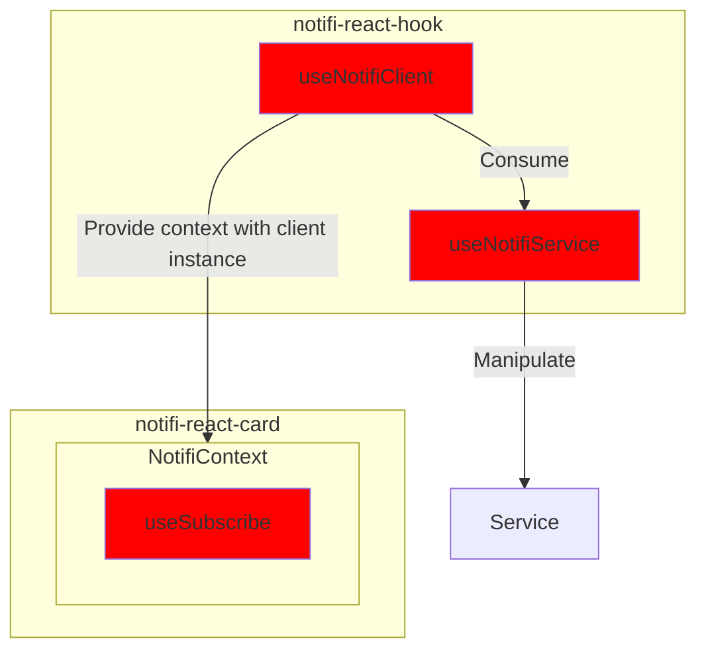
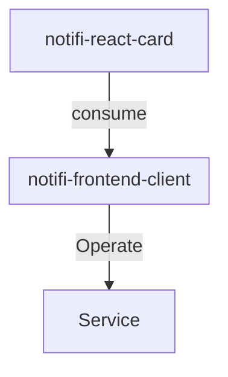
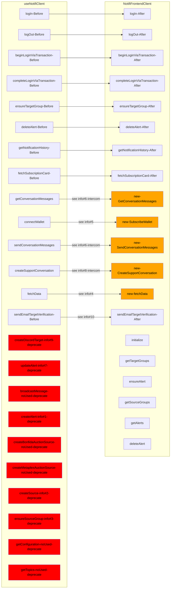
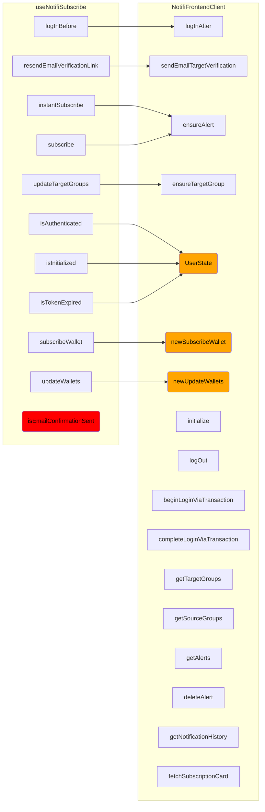
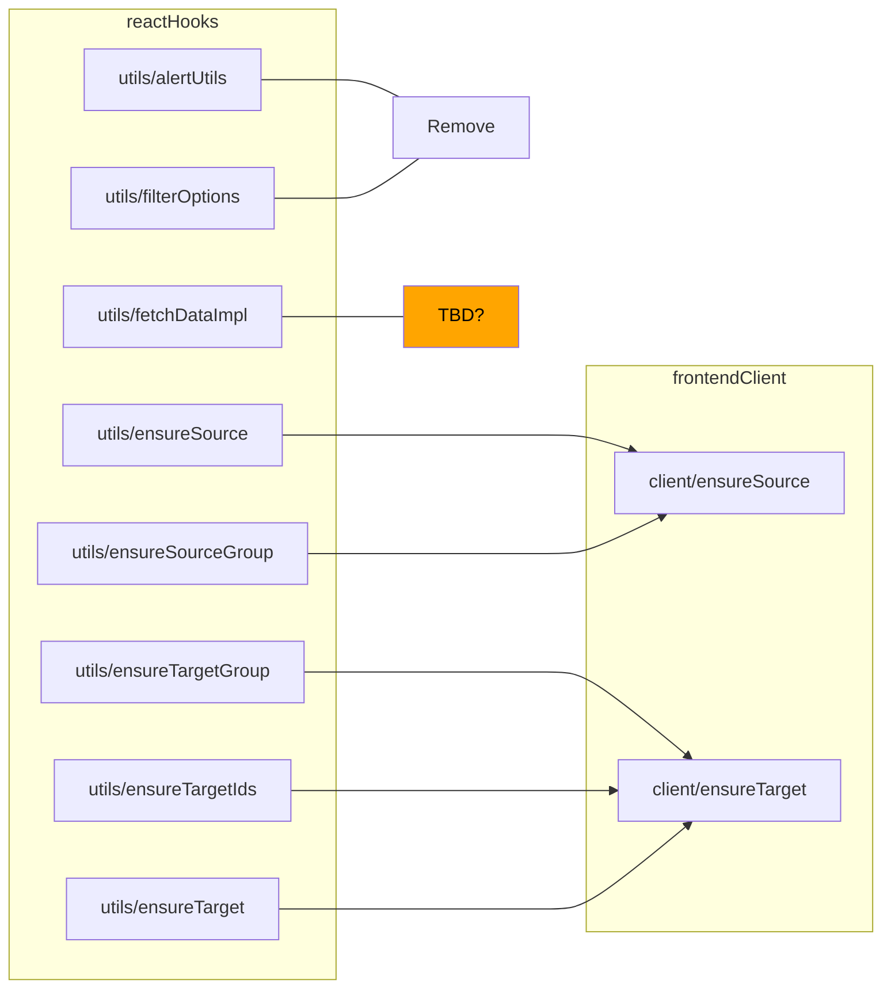

# SPIKE: notifi-sdk-ts consolidation

## Background

Currently, The way the following 3 packages interact with each other is like the flowchart below, which is complicated and hard to maintain.

1. notifi-react-hook
2. notifi-frontend-client
3. notifi-react-card



Two key points:

1. The **notifi-react-hook** is difficult to be consumed as a standalone package since it is tightly coupled with the 'notifi-react-card'.

2. The **notifi-react-card** has many complex logic to handle 'Service logic' inside its useSubscribe hook.

## Goal

To solve the problem, consolidating notifi-sdk-ts is needed so that the packages' interaction should become simple like below:



## Actions

| Action                                                                                            | Description         | point |
| ------------------------------------------------------------------------------------------------- | ------------------- | ----- |
| Consolidate notifi-react-hook (useNotifiClient) and notifi-frontend-client (NotifiFrontendClient) | See breakdown below | 3     |
| Move the logic of useNotifiSubscribe (notifi-react-card) to notifi-frontend-client                | See breakdown below | 5     |
| Extend `FrontendClient` to fully support all available chains and event types                     | See breakdown below | 3     |

## Implementation Details

### 1. Consolidate `notifi-react-hooks` and `notifi-frontend-client`

Since `notifi-react-card` will finally use `FrontendClient`(notifi-frontend-client) to manipulate service instead of using `useNotifiClient` (notifi-react-hooks), making sure the `FrontendClient` is able to cover all the functionalities of `useNotifiClient` is the first step.

#### Step1: Implement getter to get the userState

The user state `useNotifiSubscribe` and `useNotifiClient` below need to be handled somehow.

- `isAuthenticated`
- `isInitialized`
- `expiry`
- `isTokenExpired`

Need to implement a getter in FrontendClient

```ts title="packages/notifi-frontend-client/lib/client/FrontendClient.ts"
export class NotifiFrontendClient {
  // ...
  // add-start
  private _userState: UserState | null = null;
  get userState(): UserState | null {
    return this._userState;
  }
  // add-end
  // ...
  async initialize(): Promise<UserState> {
    // ...
    this._service.setJwt(authorization.token);
    // add-start
    const userState = {
      status: "authenticated",
      authorization,
      roles: roles ?? [],
    };
    this._userState = userState;
    return userState;
    // add-end
    // delete-start
    return {
      status: "authenticated",
      authorization,
      roles: roles ?? [],
    };
    // delete-end
  }
}
```

So we can replace the previous `isInitialized` with the following example code:

```ts
// ...
// delete-next-line
const { isInitialized } = useNotifiSubscribe({ targetGroupName: "Default" });
// add-start
const { userState } = client;
const isInitialized = !!userState;
// add-end
// ...
```

#### Step#2: Consolidate useNotifiClient hook and NotifiFrontendClient object

The following now methods will need to be implemented in `FrontendClient`

- [ ] getConversationMessages
- [ ] subscribeWallet
- [ ] sendConversationMessages
- [ ] createSupportConversation
      See detailed info below

<details>
<summary>useNotifiClient hook v.s. NotifiFrontendClient object </summary>



<details>
<summary>Info</summary>

1. createAlert is used updateAlertInternal. After making sure the the source is valid, the createAlert will be called. It is included in ensureAlert in frontendClient. So createAlert can be deprecated.

2. Used in updateAlertInternal, and the updateAlertInternal is used in subscribe. And in subscribe, it iterates through all existing alerts to make sure if the alert to subscribe is valid. It is the same as ensureAlert. So createSource can be deprecated.

3. In hook implementation (useNotifiClient), we firstly ensure every single source (utils/ensureSource). And then go for ensuring sourceGroup (utils/ensureSourceGroup). But in frontendClient, we only need to use ensureSourceAndFilters(frontend-client/ensureSource.ts). ensureSourceGroup can be deprecated.
4. `fetchData` in useNotifiClient is used in `useNotifiSubscribe` hook to render the client info shown in the cards. We will need to implement a new method in `FrontendClient` to replace this one.

5. Used inside subscribeWallet method in useNotifiSubscribe. It allows user to subscribe multiWallet if the dapp tenant enable multiWallet subscription. NotifiFrontendClient needs to impl new subscribeWallet method to replace this one as well as the `subscribeWallet` in useNotifiSubscribe hook.

6. Used inside `useItercomChat` hook. Might need to simply impl `getConversationMessages` & `sendConversationMessages` stateless method in `FrontendClient`. (TBD)

7. Used inside `updateAlertInternal` which is used in `subscribe` method in useNotifiSubscribe. `subscribe` method can be replaced with `FrontendClient.ensureAlert` method. So `updateAlert` can be deprecated.

8. Used inside `IntercomCard` as a button handler. Might need to simply impl `createSupportConversation` stateless method in `FrontendClient`. (TBD)

9. Used in `subscribe` method in useNotifiSubscribe. `subscribe` method can be replaced with `FrontendClient.ensureAlert` method. So `createDiscordTarget` can be deprecated.

10. Used in `resendEmailVerificationLink` method in `useNotifiSubscribe`. NotifiFrontendClient has the sendEmailTargetVerification method which will cover both `resendEmailVerificationLink` in useNotifiSubscribe and `sendEmailTargetVerification` in useNotifiClient hook.

</details>

</details>

#### Step#3: Consolidate useNotifiSubscribe hook and NotifiFrontendClient object

We need to extract the logic of `useNotifiSubscribe` hook in `notifi-react-card` to `NotifiFrontendClient` object in `notifi-frontend-client` package.

So the 2nd step will be implementing the following new methods into `FrontendClient`

- [ ] userState
- [ ] subscribeWallet
- [ ] updateWallets

See detailed info below

<details>
<summary>useNotifiSubscribe hook v.s. NotifiFrontendClient object </summary>



</details>

<details>
<summary>FilterOptions.ts</summary>

:::tip
It is copy-paste from `core`, consider remove
:::

- `./packages/notifi-frontend-client/lib/models/FilterOptions.ts`
- `packages/notifi-core/lib/NotifiClient.ts`

</details>

### 2. Move the logic of useNotifiSubscribe (notifi-react-card) to notifi-frontend-client

#### Step#1 Replace the `useNotifiClient` dependency with `FrontendClient` object.

```ts title="packages/notifi-react-card/lib/context/NotifiClientContext.tsx"
export const NotifiClientContextProvider: React.FC<NotifiParams> = ({
  children,
  ...params
}: React.PropsWithChildren<NotifiParams>) => {
  // delete-next-line
  const client = useNotifiClient(params);
  // add-start
  const config: NotifiFrontendConfiguration =  "conditional check walletBlcokchain"; // use newXXXconfig to create config
  const storage = useMemo(()=> newNotifiStorage(config), [config]);
  const service = useMemo (()=> newNotifiService(config), [config]);
  const client = useMemo(() => new FrontendClient(params, storage, service), [ storage, service]));
  // add-end
  return (
    <NotifiClientContext.Provider value={{ client, params }}>
      {children}
    </NotifiClientContext.Provider>
  );
};
```

#### Step#2 Use client to replace the methods imported from `useNotifiSubscribe`

We need to replace the methods imported from `useNotifiSubscribe` with `FrontendClient` object provided by context. The following components are using `useNotifiSubscribe`:

- `packages/notifi-react-card/lib/components/intercom/IntercomCard.tsx`

```ts title="packages/notifi-react-card/lib/components/intercom/IntercomCard.tsx"
// delete-start
const { instantSubscribe, isAuthenticated, isInitialized } = useNotifiSubscribe({
  targetGroupName: "Intercom",
});
// delete-end
// add-start
const { client } = useNotifiClientContext();
const { userState, ensureAlert } = client;
const isInitialized = !!userState;
const isAuthenticated = client.userState?.status === "authenticated";

// add-end
```

- `packages/notifi-react-card/lib/components/subscription/EventTypeDirectPushRow.tsx`
- `packages/notifi-react-card/lib/components/subscription/EventTypeCustomHealthCheckRow.tsx`
- `packages/notifi-react-card/lib/components/subscription/EventTypeCustomToggleRow.tsx`
- `packages/notifi-react-card/lib/components/subscription/EventTypeHealthCheckRow.tsx`
- `packages/notifi-react-card/lib/components/subscription/EventTypePriceChangeRow.tsx`
- `packages/notifi-react-card/lib/components/subscription/EventTypeTradingPairsRow.tsx`
- `packages/notifi-react-card/lib/components/subscription/EventTypeWalletBalanceRow.tsx`
- `packages/notifi-react-card/lib/components/subscription/EventTypeXMTPRow.tsx`
- `packages/notifi-react-card/lib/components/subscription/EventTypeBroadcastRow.tsx`

```ts title="packages/notifi-react-card/lib/components/subscription/EventTypeBroadcastRow.tsx"
// delete-start
const { instantSubscribe } = useNotifiSubscribe({
  targetGroupName: "Default",
});
// delete-end
// add-start
const { client } = useNotifiClientContext();
const { ensureAlert } = client;
// add-end
```

- `packages/notifi-react-card/lib/components/subscription/NotifiSubscribeButton.tsx`

```ts title="packages/notifi-react-card/lib/components/subscription/NotifiSubscribeButton.tsx"
// delete-start
const { isInitialized, subscribe, updateTargetGroups } = useNotifiSubscribe({
  targetGroupName: "Default",
});
// delete-end
// add-start
const { client } = useNotifiClientContext();
const { ensureAlert, ensureTargetGroup, userState } = client;
const isInitialized = !!userState;
// add-end
```

- `packages/notifi-react-card/lib/components/subscription/NotifiSubscriptionCardContainer.tsx`

```ts title="packages/notifi-react-card/lib/components/subscription/NotifiSubscriptionCardContainer.tsx"
// delete-next-line
const { isInitialized } = useNotifiSubscribe({ targetGroupName: "Default" });
// add-start
const { client } = useNotifiClientContext();
const { userState } = client;
const isInitialized = !!userState;
// add-end
```

- `packages/notifi-react-card/lib/components/subscription/SubscriptionCardV1.tsx`

```ts title="packages/notifi-react-card/lib/components/subscription/SubscriptionCardV1.tsx"
// delete-start
const { isInitialized, isTokenExpired } = useNotifiSubscribe({
  targetGroupName: "Default",
});
// delete-end
// add-start
const { client } = useNotifiClientContext();
const { userState } = client;
const isInitialized = !!userState;
const isTokenExpired = userState?.status === "expired";
// add-end
```

- `packages/notifi-react-card/lib/components/subscription/subscription-card-views/ExpiredTokenViewCard.tsx`

```ts title="packages/notifi-react-card/lib/components/subscription/subscription-card-views/ExpiredTokenViewCard.tsx"
// delete-start
const { logIn } = useNotifiSubscribe({ targetGroupName: "Default" });
// delete-end
// add-start
const { client } = useNotifiClientContext();
const { logIn } = client;
// add-end
```

- `packages/notifi-react-card/lib/components/subscription/subscription-card-views/VerifyWalletView.tsx`

```ts title="packages/notifi-react-card/lib/components/subscription/subscription-card-views/VerifyWalletView.tsx"
// delete-start
const { subscribe, updateWallets } = useNotifiSubscribe({
  targetGroupName: "Default",
});
// delete-end
// add-start
const { client } = useNotifiClientContext();
const { ensureAlert, login, fetchData } = client;
// add-end
```

:::tip

`updateWallets` is trying to call `login` and `ensureSourceGroup` methods. Then finally `fetchData` to get updated data

:::

-`packages/notifi-react-card/lib/components/WalletList/ConnectWalletRow.tsx`

```ts title="packages/notifi-react-card/lib/components/WalletList/ConnectWalletRow.tsx"
// delete-start
const { subscribeWallet } = useNotifiSubscribe({
  targetGroupName: "Default",
});
// delete-end
// add-start
const { client } = useNotifiClientContext();
const { subscribeWallet } = client;
// add-end
```

#### Step#3 Ensure all direct client usage in `notifi-react-card` can be normally used.

1. `packages/notifi-react-card/lib/components/intercom/IntercomCard.tsx`

```ts title="packages/notifi-react-card/lib/components/intercom/IntercomCard.tsx"
const { client } = useNotifiClientContext();

const result = await client.createSupportConversation();
```

2. `packages/notifi-react-card/lib/components/subscription/EventTypeDirectPushRow.tsx`

```ts title="packages/notifi-react-card/lib/components/subscription/subscription-card-views/HistoryCardView.tsx"
const { client } = useNotifiClientContext();
const result = await client.getNotificationHistory({
  first,
  after,
});
```

3. `packages/notifi-react-card/lib/hooks/useIntercomCard.ts`

```ts title="packages/notifi-react-card/lib/hooks/useIntercomCard.ts"
const { client } = useNotifiClientContext();
client.fetchSubscriptionCard({
  type: "INTERCOM_CARD",
  id: cardId,
});
```

4. `packages/notifi-react-card/lib/hooks/useIntercomChat.ts`

```ts title="packages/notifi-react-card/lib/hooks/useIntercomChat.ts"
const { client } = useNotifiClientContext();
client.getConversationMessages({
  first: 50,
  getConversationMessagesInput: { conversationId },
});
```

5. `packages/notifi-react-card/lib/hooks/useSubscriptionCard.ts`

```ts title="packages/notifi-react-card/lib/hooks/useSubscriptionCard.ts"
const { client } = useNotifiClientContext();
client.fetchSubscriptionCard(input);
```

### 3. Extend `FrontendClient` to fully support all available chains and event types

#### Step#1 Make all supported chains available in `notifi-frontend-client`

Currently, we only have `APTOS`, `EVM` and `SOLANA` supported in `notifi-frontend-client`.

We need to add the config `NotifiFrontendConfiguration` generator for all the supported chains.

- `newSuiConfig()`
- `newNearConfig()`
- `newAcalaConfig()`
- `newInjectiveConfig()` --> TBD??

```ts title="./packages/notifi-frontend-client/configuration/NotifiFrontendConfiguration.ts"
// highlight-start
export type NotifiFrontendConfiguration = NotifiSolanaConfiguration | NotifiAptosConfiguration;
// highlight-end

export type NotifiAptosConfiguration = Readonly<{
  walletBlockchain: 'APTOS';
  authenticationKey: string;
  accountAddress: string;
}> &
  NotifiEnvironmentConfiguration;

export const newAptosConfig =
// ...

export type NotifiSolanaConfiguration = Readonly<{
  walletBlockchain: "SOLANA";
  walletPublicKey: string;
}> &
  NotifiEnvironmentConfiguration;

export const newSolanaConfig =
// ...
// Need to add the reset of the chains
```

#### Step#2: Make all supported event available in `notifi-frontend-client`

Now, `notifi-frontend-client` only supports:

```ts
export type EventTypeItem =
  | DirectPushEventTypeItem
  | BroadcastEventTypeItem
  | LabelEventTypeItem
  | PriceChangeEventTypeItem
  | CustomTopicTypeItem;
```

But in `notifi-react-card`, we have:

```ts
export type EventTypeItem =
  | DirectPushEventTypeItem
  | BroadcastEventTypeItem
  | HealthCheckEventTypeItem
  | LabelEventTypeItem
  | TradingPairEventTypeItem
  | WalletBalanceEventTypeItem
  | PriceChangeEventTypeItem
  | CustomTopicTypeItem
  | XMTPTopicTypeItem;
```

## References

1. type changes from using `notifi-core` to `notifi-graphql`:

Below is an example of type difference between react-frontend-client and react-hook.

```ts title="packages/notifi-frontend-client/lib/client/NotifiFrontendClient.ts"
  async completeLoginViaTransaction({
    walletBlockchain,
    walletAddress,
    transactionSignature,
    // highlight-start
    // The input and output are from notifi-graphql
  }: CompleteLoginProps): Promise<Types.CompleteLogInByTransactionMutation>
  // highlight-end
  // ...

  type CompleteLoginProps = Omit<
  // highlight-next-line
  Types.CompleteLogInByTransactionInput,
  'dappAddress' | 'randomUuid'
>;
```

```ts title="packages/notifi-graphql/lib/gql/generated.ts"
export type CompleteLogInByTransactionInput = {
  /** The dapp id for this tenant */
  dappAddress: Scalars["String"];
  /** Random client generated UUID used in hash generation of nonce+uuid */
  randomUuid: Scalars["String"];
  /** Timestamp in seconds since Unix epoch. Required for Aptos chain. This will be the timestamp on the transaction. */
  timestamp?: InputMaybe<Scalars["Long"]>;
  /** Transaction containing the Base64(SHA256(hash(nonce+uuid))) printed to 'Notifi Auth: <value>' */
  transactionSignature: Scalars["String"];
  /** Address of wallet attempting to log in with */
  walletAddress: Scalars["String"];
  /** Blockchain of the wallet */
  walletBlockchain: WalletBlockchain;
  /** Public key of wallet attempting to log in with. Required for Aptos chain. */
  walletPublicKey?: InputMaybe<Scalars["String"]>;
};

export type CompleteLogInByTransactionMutation = {
  __typename?: "NotifiMutation";
  completeLogInByTransaction?:
    | {
        __typename?: "User";
        email?: string | undefined;
        emailConfirmed: boolean;
        roles?: Array<string | undefined> | undefined;
        authorization?: { __typename?: "Authorization"; token: string; expiry: string } | undefined;
      }
    | undefined;
};
```

```ts title="packages/notifi-react-hooks/lib/hooks/useNotifiClient.ts"
const completeLoginViaTransaction = useCallback(
    async (
      // highlight-start
      // The input and output are from notifi-core
      input: CompleteLoginViaTransactionInput
      // highlight-end
    ): Promise<CompleteLoginViaTransactionResult>
    // ...
```

```ts title="packages/notifi-core/lib/NotifiClient.ts"
export type CompleteLoginViaTransactionInput = Readonly<{
  transactionSignature: string;
}>;

export type CompleteLoginViaTransactionResult = Readonly<User>;

export type User = Readonly<{
  email: string | null;
  emailConfirmed: boolean;
  authorization: Authorization | null;
  roles: ReadonlyArray<string> | null;
}>;
```

<details>

<summary>Question: storage modules</summary>

- `packages/notifi-react-hooks/lib/utils/storage.ts`
- `packages/notifi-frontend-client/lib/storage/NotifiFrontendStorage.ts`

:::caution
**Questions**

- What is oldValue for?
- Why we have to reset the key to newKey with expired authorization when the oldKey is not null?

```ts title="packages/notifi-react-hooks/lib/utils/storage.ts"
// ...
const oldKey = `${jwtPrefix}:${dappAddress}:${walletPublicKey}`;
const newKey = `${jwtPrefix}:${dappAddress}:${walletPublicKey}:authorization`;
const getAuthorization = async () => {
  const oldValue = await localforage.getItem<string>(oldKey);
  if (oldValue !== null) {
    const expiry = new Date();
    expiry.setMinutes(expiry.getMinutes() - 1); // Assume expired
    const migrated: Authorization = {
      token: oldValue,
      expiry: expiry.toISOString(),
    };

    await localforage.removeItem(oldKey);
    await localforage.setItem(newKey, migrated);
  }

  return await localforage.getItem<Authorization>(newKey);
};
```

- It seems like the `oldKey` logic does not appear in frontend-client.

```ts title="packages/notifi-frontend-client/lib/storage/NotifiFrontendStorage.ts"
export const createLocalForageStorageDriver = (config: NotifiFrontendConfiguration): StorageDriver => {
  // highlight-next-line
  let keyPrefix = `${getEnvPrefix(config.env)}:${config.tenantId}`;
  switch (config.walletBlockchain) {
    case "SOLANA": {
      keyPrefix += `:${config.walletPublicKey}`;
      break;
    }
    case "APTOS": {
      keyPrefix += `:${config.accountAddress}:${config.authenticationKey}`;
      break;
    }
  }
  // ...
};
```

> **Note**: The duplicated code also happens in `/notifi-frontend-client/lib/storage/InMemoryStorageDriver.ts` and `/notifi-frontend-client/lib/storage/LocalForageStorageDriver.ts`

- Why does frontend-client has iInMemoryStorageDriver? and what is it for

:::

</details>

<details>
<summary>utils modules mapping (hooks and frontendClient)</summary>
- `packages/notifi-react-hooks/lib/utils`
- `packages/notifi-frontend-client/lib/client`



:::info

- `alertUtils` is totally not used --> deprecate.
- `fetchDataImpl` only used in hooks doing internal data fetching. In frontendClient, the source or target not exist, error will be directly thrown. --> deprecate.

:::

</details>

<details>
<summary>SubscriptionCardConfig.ts </summary>

:::tip
react-card will make use of the SubscriptionCardConfig from frontend-client --> deprecate the one in react-card.
:::

- `packages/notifi-react-card/lib/hooks/SubscriptionCardConfig.ts`
- `packages/notifi-frontend-client/lib/models/SubscriptionCardConfig.ts`

</details>
