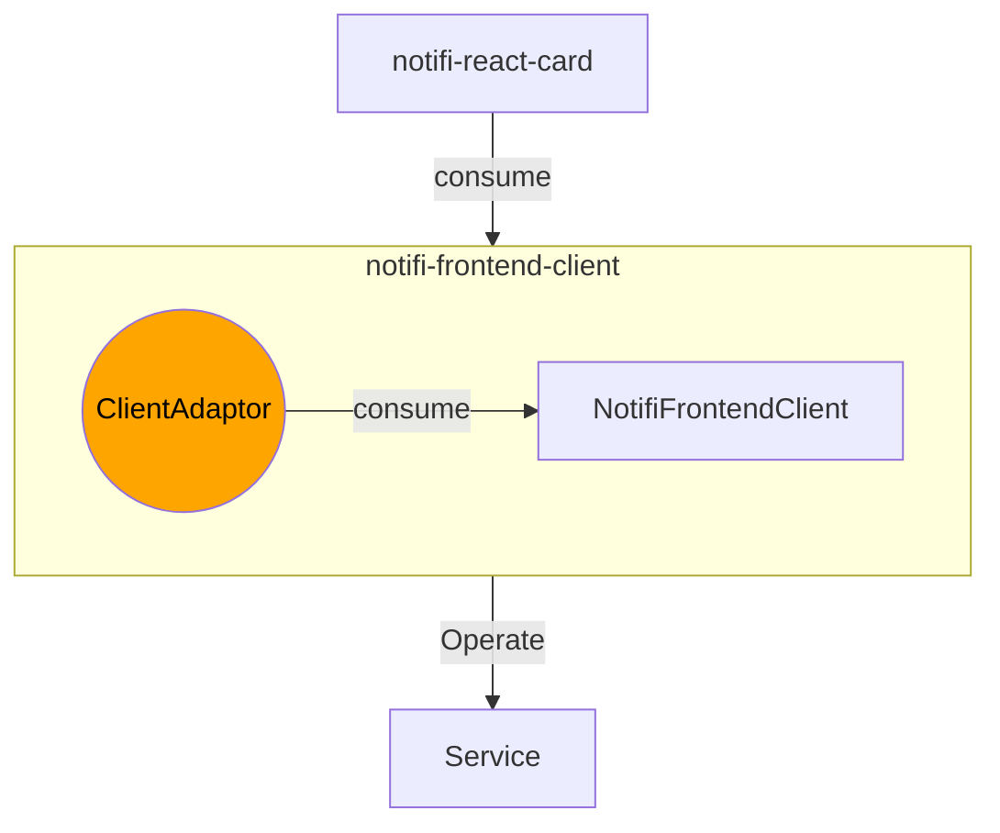
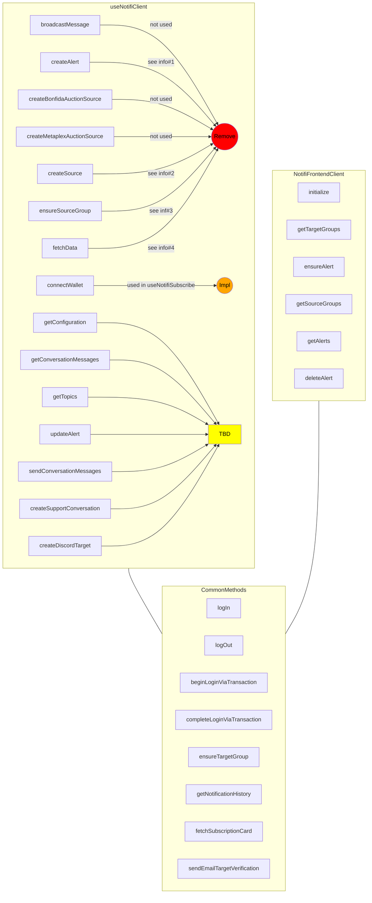

# SPIKE: notifi-sdk-ts consolidation

## Background

Currently, The way the following 3 packages interact with each other is like the flowchart below, which is complicated and hard to maintain.

1. notifi-react-hook
2. notifi-frontend-client
3. notifi-react-card


Two keys points:

1. The **notifi-react-hook** is difficult to be consumed as a standalone package since it is tightly coupled with the 'notifi-react-card'.

2. The **notifi-react-card** has many complex logic to handle 'Service logic' inside its useSubscribe hook.

## Goal

To solve the problem, consolidating notifi-sdk-ts is needed so that the packages' interaction should become simple like below:



The ClientAdaptor object will be the one represent the logic of useNotifiSubscribe hook in notifi-react-card.

> Naming of the ClientAdaptor is not fixed (TBC).

## Actions

| Action                                                                             | Description         | point |
| ---------------------------------------------------------------------------------- | ------------------- | ----- |
| Move the logic of useNotifiSubscribe (notifi-react-card) to notifi-frontend-client | See breakdown below | 5     |
| Consolidate notifi-react-hook and notifi-frontend-client                           | See breakdown below | 3     |

## Implementation Details

### 1. Move the logic of useNotifiSubscribe (notifi-react-card) to notifi-frontend-client

A new file structure (the clientAdaptor below) will be needed to support the new features (migrated from useNotifiSubscribe).

```bash
├── client
# highlight-next-line
├── clientAdaptor # new feature (migrated from useNotifiSubscribe)
├── configuration
├── index.ts
├── models
├── storage
└── utils
```

:::caution
**Question#1**:
Is it good to name it `clientAdaptor`.
:::
:::caution
**Question#2**:
Seems like the `client` in `notifi-frontend-client` is using the type source from `notifi-graphql` instead of `notifi-core`. **Does it mean we want to migrate to `notifi-graphql` from `notifi-axios-adaptor` as a result of this consolidation?** (Check on reference#1 for example)
:::

#### create useClientAdaptor hook

Migrate the logic of useNotifiSubscribe hook to useClientAdaptor hook.

```tsx title="packages/notifi-frontend-client/lib/clientAdaptor/ClientAdaptor.ts"

type ClientAdaptor = Readonly<{
  isAuthenticated: boolean;
  isEmailConfirmationSent: boolean;
  isInitialized: boolean;
  isTokenExpired: boolean;
  logIn: () => Promise<SubscriptionData>;
  subscribe: (
    alertConfigs: Record<string, AlertConfiguration>, // Move `packages/notifi-react-card/lib/utils/AlertConfiguration.ts` to `packages/notifi-frontend-client/lib/utils`
  subscribeWallet: (walletParams: ConnectWalletParams) => Promise<void>;
  updateWallets: () => Promise<void>;
  instantSubscribe: (
    subscribeData: InstantSubscribe,
  ) => Promise<SubscriptionData>;
  updateTargetGroups: () => Promise<SubscriptionData>;
  resendEmailVerificationLink: (emailId: string) => Promise<string>;
}>

const useClientAdaptor = (props: UseClientAdaptorProps): ClientAdaptor => {
  // TODO: Migrated logic from useNotifiSubscribe
}
```

### 2. Consolidate `notifi-react-hooks` and `notifi-frontend-client`

#### Step#1: Consolidate the duplicated modules in `notifi-react-hooks` and `notifi-frontend-client`

<details>
<summary>useNotifiClient hook v.s. NotifiFrontendClient object (WIP 🛠️) </summary>



<details>
<summary>Info</summary>

1. createAlert is used updateAlertInternal. After making sure the the source is valid, the createAlert will be called. It is included in ensureAlert in frontendClient. So we can remove createAlert.

2. createSource is used in updateAlertInternal, and the updateAlertInternal is used in subscribe. And in subscribe, it iterates through all existing alerts to make sure if the alert to subscribe is valid. It is the same as ensureAlert. So we can remove createSource.

3. In hook implementation (useNotifiClient), we firstly ensure every single source (utils/ensureSource). And then go for ensuring sourceGroup (utils/ensureSourceGroup). But in frontendClient, we only need to use ensure sourceGroup (frontend-client/ensureSource.ts). So we can remove ensureSourceGroup. TBC?
4. TBC?

</details>

</details>

<details>

<summary>storage modules</summary>

- `packages/notifi-react-hooks/lib/utils/storage.ts`
- `packages/notifi-frontend-client/lib/storage/NotifiFrontendStorage.ts`

:::caution
**Questions**

- What is oldValue for?
- Why we have to reset the key to newKey with expired authorization when the oldKey is not null?

```ts title="packages/notifi-react-hooks/lib/utils/storage.ts"
// ...
const oldKey = `${jwtPrefix}:${dappAddress}:${walletPublicKey}`;
const newKey = `${jwtPrefix}:${dappAddress}:${walletPublicKey}:authorization`;
const getAuthorization = async () => {
  const oldValue = await localforage.getItem<string>(oldKey);
  if (oldValue !== null) {
    const expiry = new Date();
    expiry.setMinutes(expiry.getMinutes() - 1); // Assume expired
    const migrated: Authorization = {
      token: oldValue,
      expiry: expiry.toISOString(),
    };

    await localforage.removeItem(oldKey);
    await localforage.setItem(newKey, migrated);
  }

  return await localforage.getItem<Authorization>(newKey);
};
```

- It seems like the `oldKey` logic does not appear in frontend-client.

```ts title="packages/notifi-frontend-client/lib/storage/NotifiFrontendStorage.ts"
export const createLocalForageStorageDriver = (config: NotifiFrontendConfiguration): StorageDriver => {
  // highlight-next-line
  let keyPrefix = `${getEnvPrefix(config.env)}:${config.tenantId}`;
  switch (config.walletBlockchain) {
    case "SOLANA": {
      keyPrefix += `:${config.walletPublicKey}`;
      break;
    }
    case "APTOS": {
      keyPrefix += `:${config.accountAddress}:${config.authenticationKey}`;
      break;
    }
  }
  // ...
};
```

> **Note**: The duplicated code also happens in `/notifi-frontend-client/lib/storage/InMemoryStorageDriver.ts` and `/notifi-frontend-client/lib/storage/LocalForageStorageDriver.ts`

- Why does frontend-client has iInMemoryStorageDriver? and what is it for

:::

</details>

<details>
<summary>configuration modules </summary>

- `packages/notifi-react-hooks/lib/hooks/useNotifiConfig.ts`
- `packages/notifi-frontend-client/lib/configuration/NotifiFrontendConfiguration.ts`

:::tip
Basically, no need change.
:::

</details>

<details>
<summary>utils modules</summary>
- `packages/notifi-react-hooks/lib/utils`
- `packages/notifi-frontend-client/lib/client`


:::info

- `alertUtils` is totally not used --> deprecate.
- `fetchDataImpl` only used in hooks doing internal data fetching. In frontendClient, the source or target not exist, error will be directly thrown. --> deprecate.

:::

</details>

<details>
<summary>FilterOptions.ts</summary>

:::tip
It is copy-paste from `core`, consider remove
:::

- `./packages/notifi-frontend-client/lib/models/FilterOptions.ts`
- `packages/notifi-core/lib/NotifiClient.ts`

</details>

<details>
<summary>SubscriptionCardConfig.ts </summary>

:::tip
react-card will make use of the SubscriptionCardConfig from frontend-client --> deprecate the one in react-card.
:::

- `packages/notifi-react-card/lib/hooks/SubscriptionCardConfig.ts`
- `packages/notifi-frontend-client/lib/models/SubscriptionCardConfig.ts`

</details>

#### Step#2 Make all supported chains available in `notifi-frontend-client`

Currently, we only have `APTOS` and `SOLANA` supported in `notifi-frontend-client`.

```ts title="./packages/notifi-frontend-client/configuration/NotifiFrontendConfiguration.ts"
// highlight-start
export type NotifiFrontendConfiguration = NotifiSolanaConfiguration | NotifiAptosConfiguration;
// highlight-end

export type NotifiAptosConfiguration = Readonly<{
  walletBlockchain: 'APTOS';
  authenticationKey: string;
  accountAddress: string;
}> &
  NotifiEnvironmentConfiguration;

export const newAptosConfig =
// ...

export type NotifiSolanaConfiguration = Readonly<{
  walletBlockchain: "SOLANA";
  walletPublicKey: string;
}> &
  NotifiEnvironmentConfiguration;

export const newSolanaConfig =
// ...
// Need to add the reset of the chains
```

#### Step#3: Make all supported event available in `notifi-frontend-client`

Now, `notifi-frontend-client` only supports:

```ts
export type EventTypeItem =
  | DirectPushEventTypeItem
  | BroadcastEventTypeItem
  | LabelEventTypeItem
  | PriceChangeEventTypeItem
  | CustomTopicTypeItem;
```

But in `notifi-react-card`, we have:

```ts
export type EventTypeItem =
  | DirectPushEventTypeItem
  | BroadcastEventTypeItem
  | HealthCheckEventTypeItem
  | LabelEventTypeItem
  | TradingPairEventTypeItem
  | WalletBalanceEventTypeItem
  | PriceChangeEventTypeItem
  | CustomTopicTypeItem
  | XMTPTopicTypeItem;
```

## References

1. type changes from using `notifi-core` to `notifi-graphql`:

Below is an example of type difference between react-frontend-client and react-hook.

```ts title="packages/notifi-frontend-client/lib/client/NotifiFrontendClient.ts"
  async completeLoginViaTransaction({
    walletBlockchain,
    walletAddress,
    transactionSignature,
    // highlight-start
    // The input and output are from notifi-graphql
  }: CompleteLoginProps): Promise<Types.CompleteLogInByTransactionMutation>
  // highlight-end
  // ...

  type CompleteLoginProps = Omit<
  // highlight-next-line
  Types.CompleteLogInByTransactionInput,
  'dappAddress' | 'randomUuid'
>;
```

```ts title="packages/notifi-graphql/lib/gql/generated.ts"
export type CompleteLogInByTransactionInput = {
  /** The dapp id for this tenant */
  dappAddress: Scalars["String"];
  /** Random client generated UUID used in hash generation of nonce+uuid */
  randomUuid: Scalars["String"];
  /** Timestamp in seconds since Unix epoch. Required for Aptos chain. This will be the timestamp on the transaction. */
  timestamp?: InputMaybe<Scalars["Long"]>;
  /** Transaction containing the Base64(SHA256(hash(nonce+uuid))) printed to 'Notifi Auth: <value>' */
  transactionSignature: Scalars["String"];
  /** Address of wallet attempting to log in with */
  walletAddress: Scalars["String"];
  /** Blockchain of the wallet */
  walletBlockchain: WalletBlockchain;
  /** Public key of wallet attempting to log in with. Required for Aptos chain. */
  walletPublicKey?: InputMaybe<Scalars["String"]>;
};

export type CompleteLogInByTransactionMutation = {
  __typename?: "NotifiMutation";
  completeLogInByTransaction?:
    | {
        __typename?: "User";
        email?: string | undefined;
        emailConfirmed: boolean;
        roles?: Array<string | undefined> | undefined;
        authorization?: { __typename?: "Authorization"; token: string; expiry: string } | undefined;
      }
    | undefined;
};
```

```ts title="packages/notifi-react-hooks/lib/hooks/useNotifiClient.ts"
const completeLoginViaTransaction = useCallback(
    async (
      // highlight-start
      // The input and output are from notifi-core
      input: CompleteLoginViaTransactionInput
      // highlight-end
    ): Promise<CompleteLoginViaTransactionResult>
    // ...
```

```ts title="packages/notifi-core/lib/NotifiClient.ts"
export type CompleteLoginViaTransactionInput = Readonly<{
  transactionSignature: string;
}>;

export type CompleteLoginViaTransactionResult = Readonly<User>;

export type User = Readonly<{
  email: string | null;
  emailConfirmed: boolean;
  authorization: Authorization | null;
  roles: ReadonlyArray<string> | null;
}>;
```
