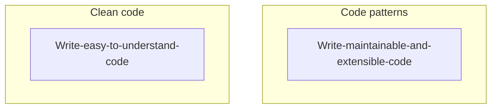

# Clean or Extensible code

In most of the time, we want to write clean code in our project. At the same time we also want adopt as many code patterns (or principle) as possible when the project grows.

**WHY**?? 😅

Firstly we need to know what makes these two concepts different.

So writing clean code is not necessarily to be extensible. And writing extensible code is not necessarily to be clean especially when many patterns are adopted at the same time.

It is always difficult for me to balance between these two concepts. In this section, I will try to share some concept and tips that I have learned from my experience.
