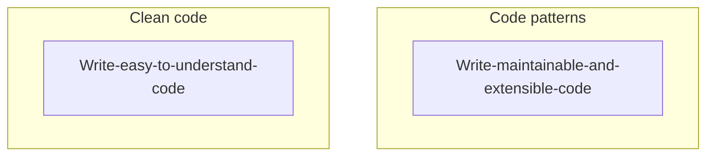

# What is good code

When we say good code, it usually means two things:

1. Readable
2. Scalable

So, in most of the time, we want to write clean code in our project. At the same time we also want have our code to be as scalable as possible.

**WHY**?? 😅

Firstly we need to know what makes these two concepts different.

So writing clean code is not necessarily to be the most scalable code. On the other hand, writing scalable code is also not necessarily to be readable.

let's list down the most important things we need to consider when writing code.

# Good code checklist

- [✅]It works
- [✅]Good use of data structures
- [✅]Code Re-use/ Do Not Repeat Yourself
- [✅]Modular - makes code more readable, maintainable and testable
- [✅]Less than O(N^2). We want to avoid nested loops if we can since they are expensive. Two separate loops are better than 2 nested loops

- [✅]Low Space Complexity --> Recursion can cause stack overflow, copying of large arrays may exceed memory of machine

:::info

The concept of `O(N^2)`, `Space Complexity`, and `Time Complexity` might be still confusing to you. Please refer to [Big O](./BigO.md) for more details.

:::

... To be continued
