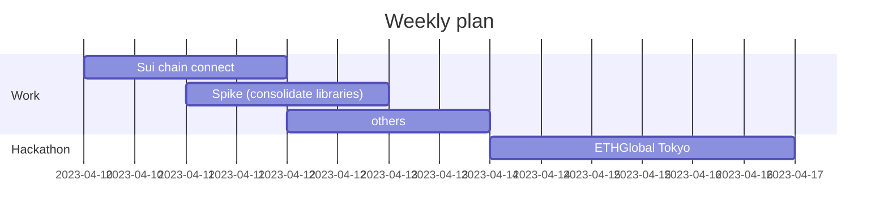

This weekend, It was a lot of fun working on the [Docusaurus](https://docusaurus.io/) site for my blog. I have been trying around to see what is the best way to create my own blog site.

I realized there are few points make me favor Docusaurus over other tools:

- Every single page is a markdown file. I can use my favorite editor to edit the content.
- I can use git to manage the content. I can use github to host the site. No longer need to worry about the server and db maintenance.
- .md markdown styled can be customized.
- Change history can be tracked by git.

The main take away for me when building up the doc system is that it make me think more about the content structure instead of the UI. At the same time, I can also take more time to take care of the site performance which I did not do before.

The performance could be easily pulled down by the static assets like images especially for such kind of doc site because there are a lot of images needs to be taken care of. However, The built package can grow very large if the static files are not optimized.

So it should be a good idea to use image CDN to host the static files needed by doc content. I will share some more my implementation details in the future.

:::tip
Cloudinary |
Imgur |
Image optimizer |
Image CDN |
:::

Next week will be a busy week for me. Big event coming up. I am going to attend the ETHGlobal Tokyo hackathon. Hope I can get some good ideas for the topic.

