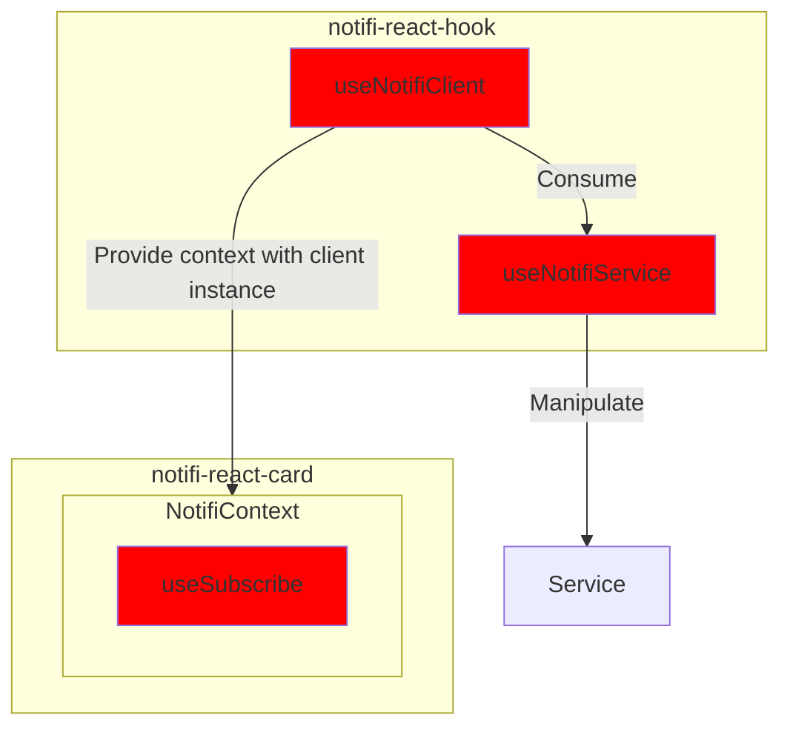
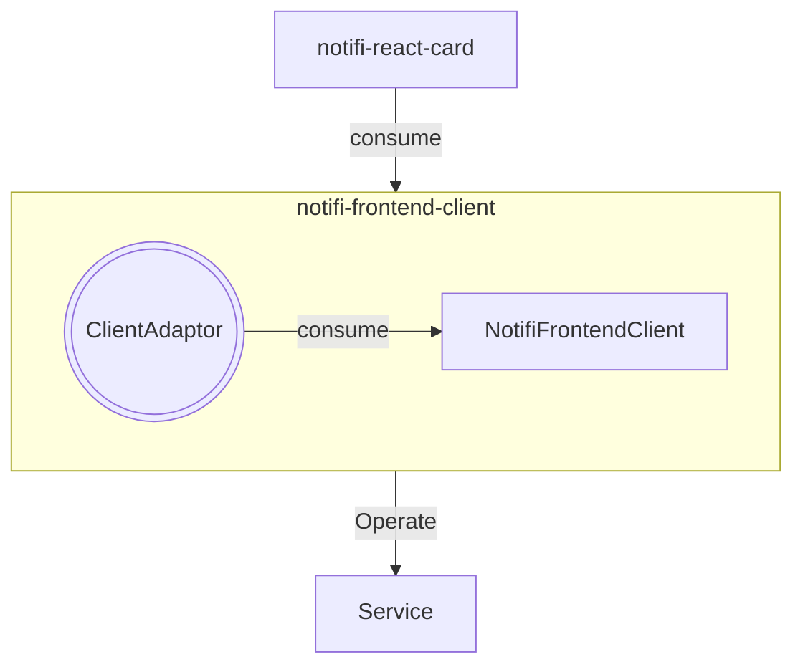

# SPIKE: notifi-sdk-ts consolidation

## Background

There are three key packages in the Notifi SDK:

1. notifi-react-hook
2. notifi-frontend-client
3. notifi-react-card

The way they interact with each other is like the flowchart below, which is complicated and hard to maintain.

Two keys points:

1. The **notifi-react-hook** is difficult to be consumed as a standalone package since it is tightly coupled with the 'notifi-react-card'.

2. At the same time, the **notifi-react-card** has many complex logic to handle 'Service logic' inside its useSubscribe hook.



## Goal

The better idea is to consolidate notifi-sdk-ts by the following steps:

1. Migrate useSubscribe hook from notifi-react-card to notifi-frontend-client.
2. Combine notifi-react-hook and notifi-frontend-client.

So the final flow will be like the flowchart below:



The ClientAdaptor object object will be the one replace the logic of useNotifiSubscribe hook in notifi-react-card.

## Implementation

### 1. Move the logic of useNotifiSubscribe (notifi-react-card) to notifi-frontend-client

For now, the notifi-frontend-client only supports 'Solana' and 'APTOS' blockchain. We will need to test if it is working before implementing more chains.

A new file structure will be needed to support the new feature under /lib/.

```bash
├── client
# highlight-next-line
├── clientAdaptor # new feature
├── configuration
├── index.ts
├── models
├── storage
└── utils
```

:::caution
**Question**:

1. Not sure if it is a good idea to call it `clientAdaptor`. So the tree will be like
2. Seems like the `client` in `notifi-frontend-client` is using the type source from `notifi-graphql` instead of `notifi-core`. **Does it mean we want to migrate to `notifi-graphql` from `notifi-axios-adaptor` as a result of this consolidation?**

Below is an example of type difference between react-frontend-client and react-hook.

```ts title="packages/notifi-frontend-client/lib/client/NotifiFrontendClient.ts"
  async completeLoginViaTransaction({
    walletBlockchain,
    walletAddress,
    transactionSignature,
    // highlight-start
    // The input and output are from notifi-graphql
  }: CompleteLoginProps): Promise<Types.CompleteLogInByTransactionMutation>
  // highlight-end
  // ...

  type CompleteLoginProps = Omit<
  // highlight-next-line
  Types.CompleteLogInByTransactionInput,
  'dappAddress' | 'randomUuid'
>;
```

```ts title="packages/notifi-graphql/lib/gql/generated.ts"
export type CompleteLogInByTransactionInput = {
  /** The dapp id for this tenant */
  dappAddress: Scalars["String"];
  /** Random client generated UUID used in hash generation of nonce+uuid */
  randomUuid: Scalars["String"];
  /** Timestamp in seconds since Unix epoch. Required for Aptos chain. This will be the timestamp on the transaction. */
  timestamp?: InputMaybe<Scalars["Long"]>;
  /** Transaction containing the Base64(SHA256(hash(nonce+uuid))) printed to 'Notifi Auth: <value>' */
  transactionSignature: Scalars["String"];
  /** Address of wallet attempting to log in with */
  walletAddress: Scalars["String"];
  /** Blockchain of the wallet */
  walletBlockchain: WalletBlockchain;
  /** Public key of wallet attempting to log in with. Required for Aptos chain. */
  walletPublicKey?: InputMaybe<Scalars["String"]>;
};

export type CompleteLogInByTransactionMutation = {
  __typename?: "NotifiMutation";
  completeLogInByTransaction?:
    | {
        __typename?: "User";
        email?: string | undefined;
        emailConfirmed: boolean;
        roles?: Array<string | undefined> | undefined;
        authorization?: { __typename?: "Authorization"; token: string; expiry: string } | undefined;
      }
    | undefined;
};
```

```ts title="packages/notifi-react-hooks/lib/hooks/useNotifiClient.ts"
const completeLoginViaTransaction = useCallback(
    async (
      // highlight-start
      // The input and output are from notifi-core
      input: CompleteLoginViaTransactionInput, notifi-core
      // highlight-end
    ): Promise<CompleteLoginViaTransactionResult>
    // ...
```

```ts title="packages/notifi-core/lib/NotifiClient.ts"
export type CompleteLoginViaTransactionInput = Readonly<{
  transactionSignature: string;
}>;

export type CompleteLoginViaTransactionResult = Readonly<User>;

export type User = Readonly<{
  email: string | null;
  emailConfirmed: boolean;
  authorization: Authorization | null;
  roles: ReadonlyArray<string> | null;
}>;
```

:::

### 2. Consolidate the duplicated modules in `notifi-react-hooks` and `notifi-frontend-client`

#### - storage modules:

- `packages/notifi-react-hooks/lib/utils/storage.ts`
- `packages/notifi-frontend-client/lib/storage/NotifiFrontendStorage.ts`

#### - configuration modules:

- `packages/notifi-react-hooks/lib/hooks/useNotifiConfig.ts`
- `packages/notifi-frontend-client/lib/configuration/NotifiFrontendConfiguration.ts`

#### - utils modules:

- `packages/notifi-react-hooks/lib/utils`
- `packages/notifi-frontend-client/lib/client`

#### - FilterOptions.ts

- `./packages/notifi-frontend-client/lib/models/FilterOptions.ts`
- `packages/notifi-core/lib/NotifiClient.ts`

#### - SubscriptionCardConfig.ts

- `packages/notifi-react-card/lib/hooks/SubscriptionCardConfig.ts`
- `packages/notifi-frontend-client/lib/models/SubscriptionCardConfig.ts`

:::caution
**TODO**:
It is still under high-level overview and not sure the scope.
Need to break down the implementation into smaller tasks.
:::

### 3. Make all supported chains available in `notifi-frontend-client`

Currently, we only have `APTOS` and `SOLANA` supported in `notifi-frontend-client`.

```ts title="./packages/notifi-frontend-client/configuration/NotifiFrontendConfiguration.ts"
// highlight-start
export type NotifiFrontendConfiguration = NotifiSolanaConfiguration | NotifiAptosConfiguration;
// highlight-end

export type NotifiAptosConfiguration = Readonly<{
  walletBlockchain: 'APTOS';
  authenticationKey: string;
  accountAddress: string;
}> &
  NotifiEnvironmentConfiguration;

export const newAptosConfig =
// ...

export type NotifiSolanaConfiguration = Readonly<{
  walletBlockchain: "SOLANA";
  walletPublicKey: string;
}> &
  NotifiEnvironmentConfiguration;

export const newSolanaConfig =
// ...
// Need to add the reset of the chains
```

### 4. Make all supported event available in `notifi-frontend-client`

Now, `notifi-frontend-client` only supports:

```ts
export type EventTypeItem =
  | DirectPushEventTypeItem
  | BroadcastEventTypeItem
  | LabelEventTypeItem
  | PriceChangeEventTypeItem;
```

But in `notifi-react-card`, we have:

```ts
export type EventTypeItem =
  | DirectPushEventTypeItem
  | BroadcastEventTypeItem
  | HealthCheckEventTypeItem
  | LabelEventTypeItem
  | TradingPairEventTypeItem
  | WalletBalanceEventTypeItem
  | PriceChangeEventTypeItem
  | CustomTopicTypeItem
  | XMTPTopicTypeItem;
```
