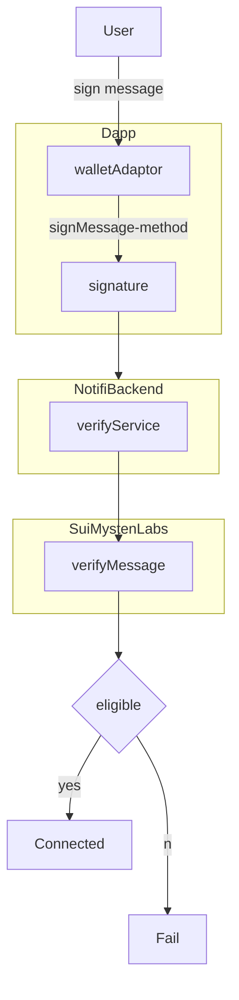

# SUI supported by Notifi SDK

Now the Dapp can use Notifi SDK to connect to SUI chain.

You can use whatever wallet adaptor to connect to SUI chain.

One thing needs to be very careful is that Notifi verifys the signature signed by the wallet using official [SUI SDK](https://github.com/MystenLabs/sui/blob/main/sdk/typescript/src/utils/verify.ts). That means the the signMessage method in the wallet adaptor should return the signature in the format of SUI SDK.



When it goes to the Fail case, the following error will be thrown from notifi backend.

```
caught (in promise) Error: GQL Errors occurred during logInFromDapp
    at makeRequestInternal (axiosRequest.ts:34:1)
    at async Object.logIn (useNotifiClient.ts:449:1)
    at async index.js:3001:1
    at async index.js:3155:1
    at async index.js:6910:1
```

## Verify if the signature is eligible

You can you the example code to check if the signature generated from the wallet is eligible.

:::tip
Make sure to install SUI SDK `npm install @mysten/sui.js`
:::

```ts
import { verifyMessage } from "@mysten/sui.js";
const verifySig = () => {
  const dummyMsgText = "Hello World";
  const dummyMsg = new TextEncoder().encode(dummyMsgText);

  // The wallet objects depends on the implemented wallet adaptor.
  // But it needs to implement signMessage method
  if (wallet) {
    const dummySig = await signer.signMessage({ message: dummyMsg });
    console.log("dummySig", dummySig);
    const signature = await wallet.signMessage({ message: dummyMsg });
    console.log("signature", signature);
    try {
      const isValid = await verifyMessage(dummyMsg, signature.signature, IntentScope.PersonalMessage);
      console.log("isValid", isValid);
      alert(isValid ? "The signature is valid" : "The signature is not valid");
    } catch (e) {
      alert(`The signature is not eligible: ${e}`);
    }
  }
};
```

## Use SUI SDK to implement signMessage method

You can also use the official SUI SDK to sign message. See the example code below:

```ts
import { Ed25519Keypair, IntentScope, RawSigner, verifyMessage } from "@mysten/sui.js";

const exampleSignAndVerify = async () => {
  const TEST_MNEMONICS = "you 12 words mnemonic here separated by space";
  const keypair_ed25519 = Ed25519Keypair.deriveKeypair(TEST_MNEMONICS, "m/44'/784'/0'/0'/0'");
  const pubkey = keypair_ed25519.getPublicKey();
  console.log("suiAddr", pubkey.toSuiAddress());
  const signer = new RawSigner(
    keypair_ed25519, // or use keypair_secp256k1 for ECDSA secp256k1
    provider as any
  );
  const dummyMsgText = "Hello World";
  const dummyMsg = new TextEncoder().encode(dummyMsgText);
  const dummySig = await signer.signMessage({ message: dummyMsg });
  console.log("dummySig", dummySig);
  const isValid = await verifyMessage(dummyMsg, dummySig.signature, IntentScope.PersonalMessage);
  console.log("isValid", isValid);
};
```
